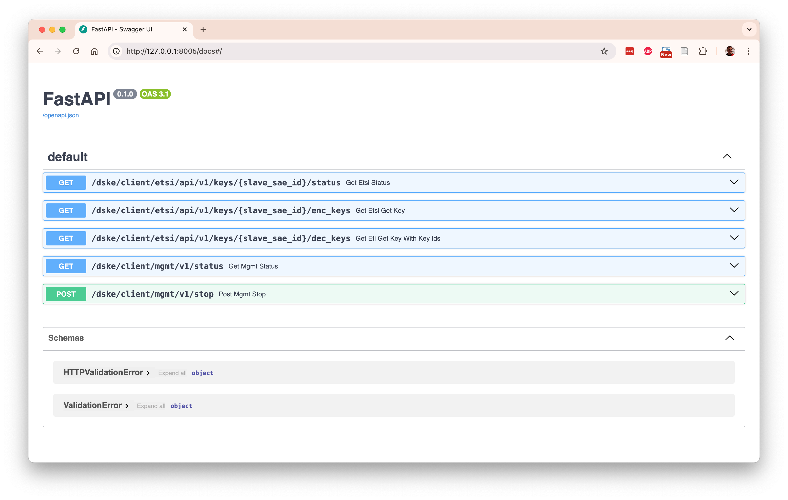
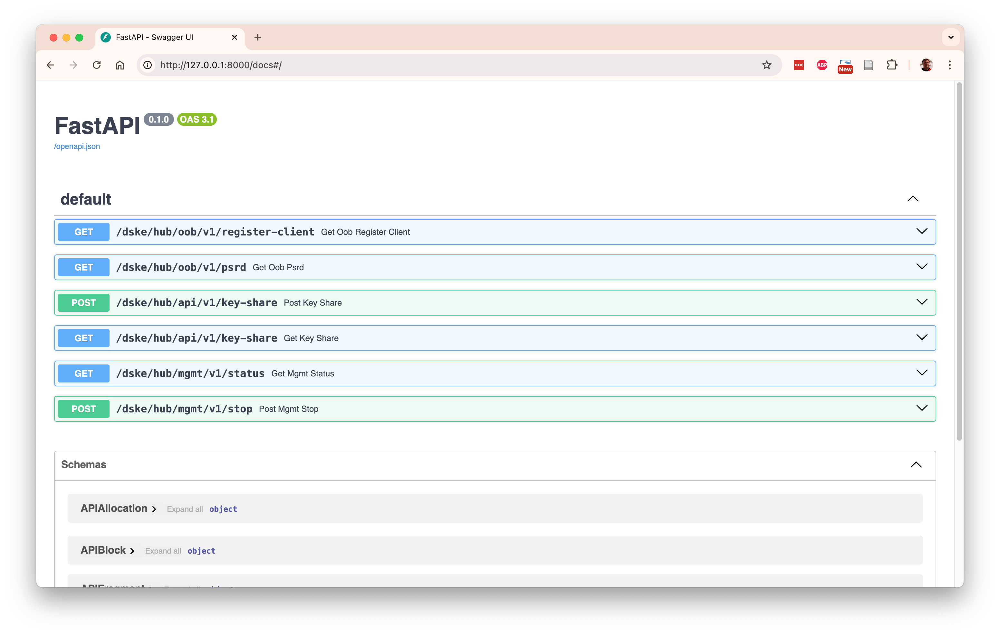
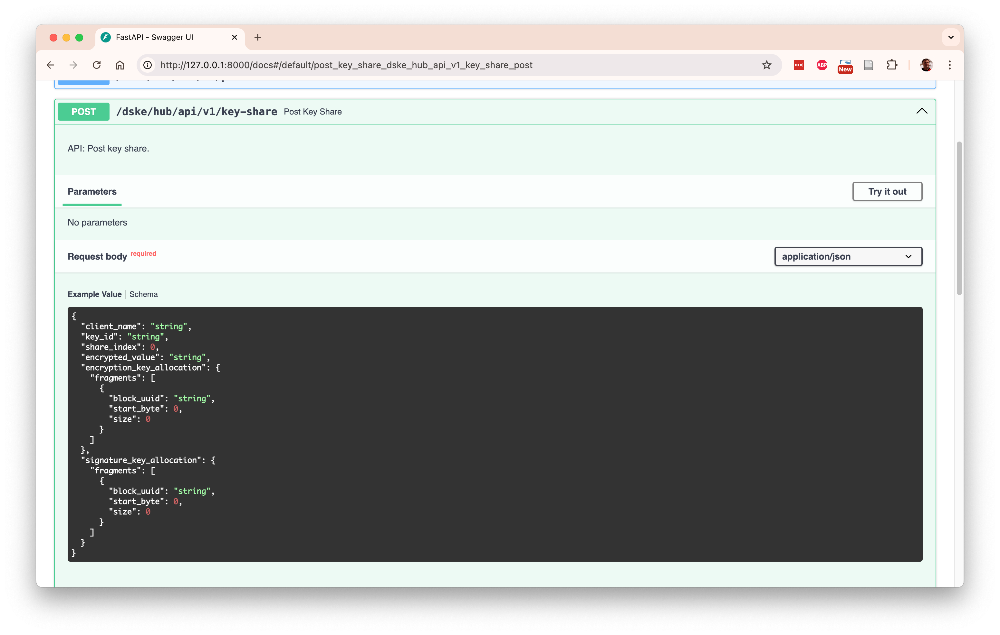

# Table of contents

* [The open source implementation of DSKE in dske-python](#the-open-source-implementation-of-dske-in-dske-python)

* [User guide](#user-guide)

* [The key distribution problem](#the-key-distribution-problem)

* [Distributed Symmetric Key Establishment (DSKE)](#distributed-symmetric-key-establishment-dske)

* [The DSKE protocol described in draft-mwag-dske-02](#the-dske-protocol-described-in-draft-mwag-dske-02)

* [Implementation notes](#implementation-notes)

# The open source implementation of DSKE in dske-python

This repository contains an open source implementation of Distributed Symmetric Key Establishment (DSKE) as
specified in IETF draft
[draft-mwag-dske-02](https://datatracker.ietf.org/doc/draft-mwag-dske/02/).

**WARNING**: The code is far from complete (definitely less than 50% done), but it is already at the
point that it can create Shamir-sharded keys between two clients and deliver it over an ETSI QKD 014
interface. 

**WARNING**: The code is intended to be a proof-of-concept to study the DSKE protocol; it is not
suitable for  production deployments for numerous reasons (e.g. there are lots of side-channel 
vulnerabilities). 

It has been developed completely independently of the authors of the draft, based only on the public
information in the draft. 
It has been developed purely out of curiosity (building something is the best way to understand it).
# User guide

## Installation

Clone the repository:

<pre>
git clone https://github.com/brunorijsman/dske-python.git
</pre>

Change directory to the cloned repository:

<pre>
cd dske-python
</pre>

We use Python 3.13 to develop and test the code.
Install Python 3.13 including venv(if needed):

<pre>
sudo add-apt-repository ppa:deadsnakes/ppa
sudo apt-get install python3.13
sudo apt-get install python3.13-venv
</pre>

Install pip (if needed):

<pre>
sudo apt-get install pip
</pre>

Create a virtual environment:

<pre>
python3.13 -m venv venv
</pre>

Activate the virtual environment:

<pre>
source venv/bin/activate
</pre>

Install de dependencies:

<pre>
pip install -r requirements.txt
</pre>

## Topology file

We need a topology YAML file which describes the topology of the network.
It lists the names of the DSKE clients (clients for short) and the
DSKE security hubs (hubs for short).
Local distributors are not yet implemented.

The repository contains an example `topology.yaml` file:

<pre>
$ <b>cat topology.yaml</b>
hubs:
  - name: hank
  - name: helen
  - name: hilary
  - name: holly
  - name: hugo
clients:
  - name: carol
  - name: celia
  - name: cindy
  - name: connie
  - name: curtis
</pre>

## The topology manager

The script `manager.py` is used to:
* Start a topology
* Stop a topology.
* Retrieve the status of one or more nodes.
* Retrieve keys from client nodes.

Use the `--help` option to see the command line parameters:

<pre>
$ <b>./manager.py --help</b>
usage: manager.py [-h] [--client CLIENT | --hub HUB] configfile {start,stop,status,etsi-qkd} ...

DSKE Manager

positional arguments:
  configfile            Configuration filename
  {start,stop,status,etsi-qkd}
    start               Start all hubs and clients
    stop                Stop all hubs and clients
    status              Report status for all hubs and clients
    etsi-qkd            ETSI QKD operations

options:
  -h, --help            show this help message and exit
  --client CLIENT       Filter on client name
  --hub HUB             Filter on hub name
</pre>

You can also use the `--help` option to see the command line parameters for a specific sub-command:

<pre>
$ <b>./manager.py topology.yaml etsi-qkd --help</b>
usage: manager.py configfile etsi-qkd [-h] master_sae_id slave_sae_id {status,get-key,get-key-with-key-ids,get-key-pair} ...

positional arguments:
  master_sae_id         Master SAE ID
  slave_sae_id          Slave SAE ID
  {status,get-key,get-key-with-key-ids,get-key-pair}
    status              Invoke ETSI QKD Status API
    get-key             Invoke ETSI QKD Get Key API
    get-key-with-key-ids
                        Invoke ETSI QKD Get Key with Key IDs API
    get-key-pair        Invoke ETSI QKD Get Key and Get Key with Key IDs APIs

options:
  -h, --help            show this help message and exit
</pre>

## Start the topology

To start the DSKE topology:

<pre>
$ <b>./manager.py topology.yaml start</b>
Starting hub hank on port 8100
Starting hub helen on port 8101
Starting hub hilary on port 8102
Starting hub holly on port 8103
Starting hub hugo on port 8104
Starting client carol on port 8105
Starting client celia on port 8106
Starting client cindy on port 8107
Starting client connie on port 8108
Starting client curtis on port 8109
</pre>

Here `topology.yaml` is the topology file that specifies the names of the hubs and clients that
are part of the topology.

Starting a topology spawns one Python process for each node, where a node is either a DSKE client 
(client for short) or a DSKE Security Hub (hub for short).  
Local distributors are not yet modelled.

You can see these processed using `ps` command:

<pre>
 $ <b>ps</b>
  PID TTY           TIME CMD
81631 ttys000    0:01.57 Python -m hub hank --port 8100
81632 ttys000    0:01.56 Python -m hub helen --port 8101
81633 ttys000    0:01.56 Python -m hub hilary --port 8102
81634 ttys000    0:01.57 Python -m hub holly --port 8103
81635 ttys000    0:01.56 Python -m hub hugo --port 8104
81636 ttys000    0:01.96 Python -m client carol --port 8105 --hubs http://127.0.0.1:8100 http://127.0.0.1:8101 http://127.0.0.1:8102 http://127.0.0.1:8103 http://127.0.0.1:8104
81637 ttys000    0:01.96 Python -m client celia --port 8106 --hubs http://127.0.0.1:8100 http://127.0.0.1:8101 http://127.0.0.1:8102 http://127.0.0.1:8103 http://127.0.0.1:8104
81638 ttys000    0:01.97 Python -m client cindy --port 8107 --hubs http://127.0.0.1:8100 http://127.0.0.1:8101 http://127.0.0.1:8102 http://127.0.0.1:8103 http://127.0.0.1:8104
81639 ttys000    0:01.97 Python -m client connie --port 8108 --hubs http://127.0.0.1:8100 http://127.0.0.1:8101 http://127.0.0.1:8102 http://127.0.0.1:8103 http://127.0.0.1:8104
81640 ttys000    0:01.96 Python -m client curtis --port 8109 --hubs http://127.0.0.1:8100 http://127.0.0.1:8101 http://127.0.0.1:8102 http://127.0.0.1:8103 http://127.0.0.1:8104
...
</pre>

The reported port numbers are the port numbers for the REST interface (including documentation) of
each node.

## REST interfaces

The nodes communicate with each other over REST interfaces, implemented using FastAPI.
There are four types of REST interfaces:

1. `api` REST interfaces model the actual DSKE protocol specified in the draft. 
   Note that the draft currently only describes the protocol at the semantic level, and not (yet)
   the message encoding. 
   We do not intend to imply that REST is the best encoding for the message encoding; a leaner 
   binary encoding may be more appropriate for this type of protocol.
   We only chose REST to make prototyping and studying the protocol easier the semantic level.

2. `oob` REST interfaces model the out-of-band actions mentioned in the draft, for example 
   delivering a block of pre-shared random data (PSRD).
   In real life, this would not be done over a REST interface but using some other mechanism
   (e.g. physically shipping a tamper-proof device with gigabytes of random data). 
   In this code we use REST interface to model these actions so that we can automate the scripting
   of entire end-to-end testing scenarios.

3. `esti` REST interfaces are implement the ETSI QKD 014 interface (a subset at this time) on the
   DSKE clients to deliver the produced keys to the Secure Application Entity (SAE) consumers.

4. `mgmt` management REST interfaces to control and debug the various nodes (e.g. to stop them and
   to retrieve operational status to "look inside" of them to see what is happening).

## REST interface documentation

The REST interface for each node is available at the reported port number when the topology was
started.

In the above example, the REST interface for hub "Hank" is available at `http://127.0.0.1:8100`

In addition to the REST interface itself, documentation is also available at
`http://127.0.0.1:8100/docs` and `http://127.0.0.1:8100/redoc`.
You can also manually invoke the REST APIs from the documentation page (click on an API endpoint
and then click on "Try it out").

Here is an example of the automatically generated documentation at `http://127.0.0.1:8105/docs`
for a client node:

Here is an example of the automatically generated documentation at `http://127.0.0.1:8100/docs`
for a hub node:

When you click on the row for `POST /dske/hub/api/v1/key-share` you see the detailed documentation
for that particular REST endpoint:

### Invoking the REST interface

Here is an example of invoking the API to get the status of 

In this example, we pipe the output of `curl` through `jq` (JSON query) to pretty-print the
JSON REST response:

<pre>
$ <b>curl --silent http://127.0.0.1:8100/dske/hub/mgmt/v1/status | jq</b>
{
  "hub_name": "hank",
  "pre_shared_key_size": 32,
  "peer_clients": [
    {
      "client_name": "carol",
      "pre_shared_key": "0O/FbKqpYW646cjs2eQmzMVqYj67VuBrY/6ItHXA9FI=",
      "pool": {
        "blocks": [
          {
            "uuid": "14c4f032-ce4c-4b9a-8ce9-bda65a5a18e5",
            "size": 1000,
            "data": "AAAAAAAAAAAAAA==...",
            "allocated": 18,
            "consumed": 16
          }
        ]
      }
    },
    {
      "client_name": "celia",
      "pre_shared_key": "jY2U8WCUg3y/rxbu6VcDr3em/AI+K+jXdk7EIEDi5BA=",
      "pool": {
        "blocks": [
          {
            "uuid": "7734118a-24f6-4fb0-9cba-8d00bbbaedc7",
            "size": 1000,
            "data": "AAAAAAAAAAAAAA==...",
            "allocated": 18,
            "consumed": 18
          }
        ]
      }
    },
    ... snip ...
  ],
  "shares": [
    {
      "key_uuid": "6050fccc-b882-402e-8ca1-62f0147999de",
      "share_index": 0,
      "value": "1AvP8kSDA1KExw==...",
      "encrypted_value": null,
      "encryption_key_allocation": null,
      "signature_key_allocation": null
    }
  ]
}
</pre>

Note 1: The `status` REST API is intended for debugging and understanding the protocol; it exposes
information that should not be exposed in a production environment.

Note 2: There is currently no authentication on any of the REST interfaces.
It is my understanding (but I could be wrong) that the DSKE protocol does not require the API
interfaces to be authenticated nor encrypted to be secure.

## Report the topology status

Use the manager `status` command to report the status of each node in the topology:

<pre>
$ <b>./manager.py topology.yaml status</b>
Status for hub hank on port 8100
{
  "hub_name": "hank",
  "pre_shared_key_size": 32,
  "peer_clients": [
    {
      "client_name": "carol",
      "pre_shared_key": "0O/FbKqpYW646cjs2eQmzMVqYj67VuBrY/6ItHXA9FI=",
      "pool": {
        "blocks": [
          {
            "uuid": "14c4f032-ce4c-4b9a-8ce9-bda65a5a18e5",
            "size": 1000,
            "data": "AAAAAAAAAAAAAA==...",
            "allocated": 18,
            "consumed": 16
          }
        ]
      }
    },
    ... snip ...
    {
      "hub_name": "holly",
      "pre_shared_key": "6++8XCkHuqv94pLNpmaf1Emm8Pd0yfug6rn/dGSU4GU=",
      "registered": true,
      "psrd_pool": {
        "blocks": [
          {
            "uuid": "67193b56-13fe-4e43-a42c-103097fcdbae",
            "size": 1000,
            "data": "hGV7ypmUQBiiBQ==...",
            "allocated": 0,
            "consumed": 0
          }
        ]
      }
    },
    {
      "hub_name": "hugo",
      "pre_shared_key": "wetCgZv8yS7PHu5ve09VROyhOidLANKvTvMbauPVM4U=",
      "registered": true,
      "psrd_pool": {
        "blocks": [
          {
            "uuid": "64ba8d8f-d26c-498f-854a-123346074072",
            "size": 1000,
            "data": "iSZnsqd1CSIEWw==...",
            "allocated": 0,
            "consumed": 0
          }
        ]
      }
    }
  ]
}
</pre>

You can also use the `--client` or `--hub` command-line option to only report the status of a single
client or hub node, for example:

<pre>
$ <b>./manager.py topology.yaml --client celia status</b>
Status for client celia on port 8106
{
  "client_name": "celia",
  "peer_hubs": [
    ... snip ...
    {
      "hub_name": "hugo",
      "pre_shared_key": "AZzkkvM4rsmq89gjsCMZCURcHpa0Y/5ZsGrtVqzICMI=",
      "registered": true,
      "psrd_pool": {
        "blocks": [
          {
            "uuid": "78a32566-5ee1-4adb-b468-91c12ae4920c",
            "size": 1000,
            "data": "AAAAAAAAAAAAAA==...",
            "allocated": 18,
            "consumed": 16
          }
        ]
      }
    }
  ]
}
</pre>

## Get encryption keys

Use the manager `get-key` sub-command under the `etsi-qkd` command to invoke the ETSI QKD 014
"Get Key" API to retrieve a key for a pair of SAEs on the master SAE.
In the following example we as master SAE "carol" for a key which is shared with slave SAE "celia":

<pre>
 $ <b>./manager.py topology.yaml etsi-qkd carol celia get-key</b>
Invoke ETSI QKD Get Key API for client carol on port 8105
master_sae_id='carol' slave_sae_id='celia'
url='http://127.0.0.1:8105/dske/client/etsi/api/v1/keys/celia/enc_keys'
response=<Response [200]>
{
  "keys": {
    "key_ID": "f47f23d7-be01-41d3-a5bc-106b2335e652",
    "key": "/j0FX08Tf9THPD0k1viX3g=="
  }
}
</pre>

Note 1: The master / slave terminology comes from ETSI QKD 014 version 1 and will be revised in 
version 2.

Note: At this point, the code assumes that there is exactly one SAE per client, and that the SAE-ID
of the SAE is the same as the name of the client.

Use the manager `get-key-with-key-ids` sub-command under the `etsi-qkd` command to invoke the 
ETSI QKD 014 "Get Key" API to retrieve a key for a pair of SAEs on the slave SAE.

<pre>
$ <b>./manager.py topology.yaml etsi-qkd carol celia get-key-with-key-ids f47f23d7-be01-41d3-a5bc-106b2335e652</b>
Invoke ETSI QKD Get Key with Key IDs API for client celia on port 8105
slave_client_name='celia' master_sae_id='carol' f47f23d7-be01-41d3-a5bc-106b2335e652
{
  "keys": [
    {
      "key_ID": "f47f23d7-be01-41d3-a5bc-106b2335e652",
      "key": "/j0FX08Tf9THPD0k1viX3g=="
    }
  ]
}
</pre>

As a matter of convenience, there is also a `get-key-pair` sub-command to combine both the
"Get Key" and the "Get Key with Key IDs" calls:

<pre>
$ <b>./manager.py topology.yaml etsi-qkd carol celia get-key-pair</b>
Invoke ETSI QKD Get Key API for client carol on port 8105
master_sae_id='carol' slave_sae_id='celia'
{
  "keys": {
    "key_ID": "cc658ffe-8d54-414b-b91f-20b59b03f034",
    "key": "jSOFUh56slAChUrzUExdbQ=="
  }
}
Invoke ETSI QKD Get Key with Key IDs API for client celia on port 8106
master_sae_id='carol' slave_sae_id='celia' cc658ffe-8d54-414b-b91f-20b59b03f034
{
  "keys": [
    {
      "key_ID": "cc658ffe-8d54-414b-b91f-20b59b03f034",
      "key": "jSOFUh56slAChUrzUExdbQ=="
    }
  ]
}
Key values match
</pre>

And, finally, there is a `status` subcommand to invoke the "Status" ETSI QKD 014 API:

<pre>
$ <b<>./manager.py topology.yaml etsi-qkd carol celia status</b>
Invoke ETSI QKD Status API for client carol on port 8105
master_sae_id='carol' slave_sae_id='celia'
{
  "source_kme_id": "carol",
  "target_kme_id": "celia",
  "master_sae_id": "carol",
  "slave_sae_id": "celia",
  "key_size": 128,
  "stored_key_count": 25000,
  "max_key_count": 1000,
  "max_key_per_request": 1,
  "max_key_size": 100000,
  "min_key_size": 1,
  "max_sae_id_count": 0
}
</pre>

Note: The implementation of the ETSI QKD API interface is far from complete.
The `size` and `number` GET parameters are not yet supported.
`POST` methods are not yet supported.
Multicast keys are not yet supported.

## Log files

Each node produces an `.out` log file for debugging purposes.
The information in this log file will vary wildly as the implementation progresses.
For example, the log file for client carol is `client-carol.out`:

<pre>
$ <b>cat client-carol.out</b>
INFO:     Started server process [81636]
INFO:     Waiting for application startup.
INFO:     Application startup complete.
INFO:     Uvicorn running on http://127.0.0.1:8105 (Press CTRL+C to quit)
INFO:     127.0.0.1:56441 - "GET /docs HTTP/1.1" 200 OK
INFO:     127.0.0.1:56441 - "GET /openapi.json HTTP/1.1" 200 OK
Share constructor: value=b'\xd4\x0b\xcf\xf2D\x83\x03R\x84\xc7\n\xd1#X\xd3`' encrypted_value=None
Share constructor: value=b'-kD\x06\x99\xb2E\xc2\xd5\xf0\xb3z\xd0Oyn' encrypted_value=None
Share constructor: value=b'\x11\x9c\x84\x19\x93\xed\xac\xa516Z\x07\xfaf\xe7\xfa' encrypted_value=None
Share constructor: value=b'\xe8\xfc\x0f\xedN\xdc\xea5`\x01\xe3\xac\tqM\xf4' encrypted_value=None
Share constructor: value=b'\xf5yZ_2o\xca\xba\xa9tN<\x1adLa' encrypted_value=None
api_share=APIShare(client_name='carol', key_id='6050fccc-b882-402e-8ca1-62f0147999de', share_index=0, encrypted_value='e2wgFBkt7R8FGubnZesLJw==', encryption_key_allocation=APIAllocation(fragments=[APIFragment(block_uuid='14c4f032-ce4c-4b9a-8ce9-bda65a5a18e5', start_byte=0, size=16)]), signature_key_allocation=APIAllocation(fragments=[APIFragment(block_uuid='14c4f032-ce4c-4b9a-8ce9-bda65a5a18e5', start_byte=16, size=2)]))
url='http://127.0.0.1:8100/dske/hub/api/v1/key-share'
... snip ...
</pre>

## Stop the topology

To stop the topology, use the manager stop command:

<pre>
$ <b>./manager.py topology.yaml stop</b>
Stopping client curtis on port 8109
Stopping client connie on port 8108
Stopping client cindy on port 8107
Stopping client celia on port 8106
Stopping client carol on port 8105
Stopping hub hugo on port 8104
Stopping hub holly on port 8103
Stopping hub hilary on port 8102
Stopping hub helen on port 8101
Stopping hub hank on port 8100
Waiting for all nodes to be stopped
</pre>

# The key distribution problem

The problem that Distributed Symmetric Key Establishment (DSKE) solves is the problem of
Symmetric Key Establishment (SKE).

Symmetric key establishment is also known by many other names, including key distribution,
key agreement, key establishment, shared secret agreement, Symmetric Key Agreement (SKA), etc.

When two parties wish to securely communicate by exchanging encrypted data, they typically use
a symmetric encryption protocol such as the
[Advanced Encryption Standard (AES)](https://nvlpubs.nist.gov/nistpubs/FIPS/NIST.FIPS.197-upd1.pdf)
.

All symmetric encryption protocols require the two communicating parties to first agree on an
encryption key.
The word "symmetric" means that the encryption key used by the sending party is the same as the
decryption key used by the receiving party.
As a result, this symmetric encryption key must be secret: it must only be known to the two parties
and not to any unauthorized eavesdropper who is attempting to steal the data.

Symmetric key establishment (a.k.a. key distribution etc.) is the mechanism that the two parties
use to establish (a.k.a. distribute, agree on, etc.) the symmetric encryption key.

There are several existing mechanisms and protocols for doing symmetric key establishment:

1. **Pre-Shared Keys (PSK)**
   
   The symmetric keys are distributed using some Out-of-Band (OOB) mechanism and pre-configured
   on the communicating encryptor devices.
   An example of such an out-of-band mechanism is that a trusted person, who can identify him or
   herself, hand-carries a tamper-proof storage devices that contains the symmetric keys.

   Pre-shared keys have several disadvantages.

   It is cumbersome and error-prone because it requires some secure out-of-band mechanism to
   distribute the keys.
   In practice, because it is so cumbersome, pre-shared keys are not rolled-over as often as they
   should.

   It is not possible to securely communicate with a party unless a pre-shared key has been
   established with that specific party a-priori. For example, securely communicating with websites
   is impractical using pre-shared keys.

2. **Traditional classical cryptographic algorithms for dynamic key establishment**

   The vast majority of secure communications on the Internet today use what we refer to 
   (for lack of a better name) as "traditional classical cryptographic algorithms for
   dynamic key establishment". 
   This includes cryptographic algorithms such as Diffie-Hellman (DH), 
   Elliptic Curve Diffie-Hellman (ECDH), and Rivest Shamir Adleman (RSA).

   All of these protocol enable two communicating parties who have never met before to dynamically
   generate a symmetric encryption key (referred to as a session key) for the duration of the
   communication session.
   Generating the key involves the two parties exchanging some messages using a so-called
   key generation protocol.
   One example of such a key generation protocol is the Internet Key Exchange (IKE) protocol.

   The interesting thing is that the key generation protocol is allowed to be a public discourse
   and still be safe.
   What this means that is impossible for an attacker (typically called an eavesdropper) to
   figure out what the dynamically generated key is, _even_ if the attacker can view all messages
   that are part of the key generation protocol.

   All of the cryptographic algorithms that we mentioned (DH, ECDH, RSA) rely on mathematical
   trap-door functions.
   These are functions that are easy to compute in one direction, but practically impossible to
   compute in the reverse direction.
   For example, it is easy to multiple two large numbers and determine their product.
   But it is practically impossible to find the original two numbers given the product, i.e.,
   to factor a number into primes.
   The security of RSA depends on this property.
   The security of DH and ECDH relies on a similar trapdoor function involving computing the
   exponents of certain special numbers (a to the power b).

3. **Post Quantum Cryptography (PQC)**

   TODO: Finish this

4. **Quantum Key Distribution (QDK)**

   TODO: Finish this
   
The problem of key distribution is very closely related to the problem of authentication.

TODO: Finish this

# Distributed Symmetric Key Establishment (DSKE)

Distributed Symmetric Key Establishment (DSKE) is a method for two (or more) parties to agree on a
symmetric encryption key. The method has the following special characteristics:

* It is Information Theoretically Secure (ITS). It method does not make any assumptions about
  computational constraints on the adversary.

* It is quantum-secure. This is a strengthening of the previous statement: even if the adversary
  has access to a quantum computer, the method remains secure.

* In particular, DSKE does not assume that the adversary cannot factor large numbers
  (which would break RSA), or that the adversary cannot compute large discrete logarithms
  (which would break DH and ECDH), or even that the adversary cannot solve Learning With Errors
  (LWE) problems (which would break ML-KEM).

* It allows any party to communicate with any party, without requiring that a Pre-Shared Key (PSK)
  must have been established out-of-band and a-priori for that specific pair of parties.

* It does require, however, that large blocks of Pre-Shared Random Data (PSRD) must have been
  shared out-of-band and a-priori between the communicating parties (known as DSKE clients) and 
  relay nodes (known as DSKE security hubs).

* These the DSKE security hubs are responsible for relaying the established keys between
  the communicating parties (i.e. between the DSKE clients).
  This relaying mechanism is both secure and resistant against Denial-of-Service (DoS) attacks.

* The symmetric key is broken up into _N_ parts, known as key shares, using an cryptographic
  algorithm called Shamir Secret Sharing (SSS).

* Each key share is distributed between the source DSKE client and the destination DSKE client
  using a different DSKE security hub.
  As a result, each DSKE security hub knows only a small part (namely a single key share) of
  the entire symmetric key.

* The destination DSKE client can reconstruct the symmetric keys by combining the key shares that
  it has received from multiple hubs.

* The destination DSKE client does not need the full set of _N_ key shares to reconstruct the
  key.
  The Shamir Secret Sharing (SSS) algorithm allows the key to be reconstructed using some smaller
  number of _K_ (where _K_ < _N_) key shares.

* Furthermore, the Shamir Secret Sharing (SSS) algorithm also guarantees that any party (such as
  and adversary) who has access to some key shares, but fewer than _K_ key shares, has zero
  knowledge about the key.
  In other words, it is not possible for the adversary to reconstruct some partial knowledge of
  the key by having some subset of the required _K_ key shares.

* This means that the adversary would have to simultaneously successfully compromise at least _K_
  DSKE security hubs to be able to recover the key from the observed key shares.
  In other words, while the DSKE security hubs do have some aspects of being a Trusted Relay Node
  (TRN), compromising a single relay node is not enough get the key;
  the adversary has to compromise at least _K_ relay nodes at the same time.

* The protocol is also resilient against Denial of Service (DOS) attacks and failures.
  The key shares are relayed over _N_ distinct paths (i.e. through _N_ different DSKE security
  hubs).
  If some number of the paths fail because of a fiber cut or a node failure, the end-to-end
  key establishment protocol still succeeds, as long as _K_ paths remain functional (i.e.
  as long as no more than _N-K_ paths fail).

* All communications between DSKE clients and DSKE hubs are both One-Time Pad (OTP) encrypted and
  authenticated using single-use keys extracted from the pre-shared random data.
  Note: to avoid confusion we will use the term "key" to refer to the secret symmetric keys
  that are established between DSKE clients, and we will use the term "DSKE key" to refer
  to key material that is consumed from the pre-shared random data blocks to protect the DSKE
  protocol itself (i.e. to encrypt and authenticate DSKE protocol messages).
  
TODO: Add figures to clarify the above

DSKE is described in detail in the following arXiv papers:

 * arXiv:2205.00615: 
   Distributed Symmetric Key Establishment: A scalable, quantum-proof key distribution system. 
   [https://arxiv.org/abs/2205.00615](https://arxiv.org/abs/2205.00615)

 * arXiv:2304.13789 
   Composable Security of Distributed Symmetric Key Establishment Protocol. 
   [https://arxiv.org/abs/2304.13789]](https://arxiv.org/abs/2304.13789)

There is also an Internet Engineering Task Force (IETF) Internet-Draft (I-D):

* draft-mwag-dske-02 
  The Distributed Symmetric Key Establishment (DSKE) Protocol. 
  [https://datatracker.ietf.org/doc/draft-mwag-dske/02/](https://datatracker.ietf.org/doc/draft-mwag-dske/02/)

This draft describes the protocol in general terms.
It does not (yet) describe the protocol in sufficient detail to enable interoperable
implementations.
For example, only the semantics but not yet the syntax of protocol messages is described.

# The DSKE protocol described in draft-mwag-dske-02

TODO: Finish this

## Implementation notes

The code is implemented in Python 3.12 and uses FastAPI.

TODO: Finish this