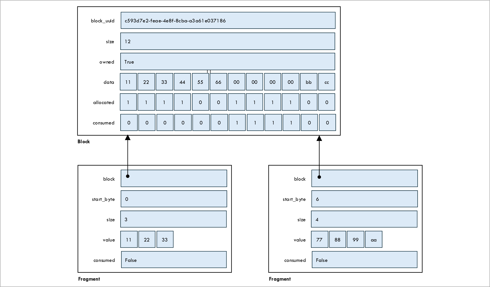

[Back to main page](/README.md)

# Developer guide

## Technology stack

Our technology stack is:
* [Python 3.13](https://www.python.org/) as the programming language.
* [FastAPI](https://www.python.org/) for HTTP APIs.
* [Git](https://git-scm.com/) and [Github](https://github.com/brunorijsman/dske-python) for version control.
* [Github actions](https://github.com/features/actions) for continuous integration.
* [Pylint](https://pypi.org/project/pylint/) for linting.
* [Black](https://black.readthedocs.io/) for code formatting.
* [Coverage](https://coverage.readthedocs.io/) for code coverage.
* [Pip](https://pypi.org/project/pip/) for dependency management.
* [Venv](https://docs.python.org/3/library/venv.html) for virtual environments.

## DSKE protocol

The Distributed Symmetric Key Establishment (DSKE) implementation in this repository is based on
IETF draft
[draft-mwag-dske-02](https://datatracker.ietf.org/doc/draft-mwag-dske/02/).
It has been developed completely independently of the authors of the draft, based only on the public
information in the draft.
See [the DSKE protocol page](/docs/dske-protocol.md) for more details.

## Proof of concept

The code is intended to be a proof-of-concept to study the DSKE protocol; it is not
suitable for  production deployments for numerous reasons (e.g. we have made no effort to prevent
side-channel attacks).

## Check-and-test script

The `check-and-test` bash script in the `scripts` directory does the following:
* Lints the code.
* Checks the formatting of the code.
* Runs all unit tests.
* Runs all system tests.
* Measures code coverage when running the tests.

A Github action workflow runs this script on every push to our repository.

The `--help` option explains it's usage:

<pre>
$ <b>scripts/check-and-test --help</b>
Usage: check-and-test [OPTIONS] [ACTION]

Positional arguments:
  ACTION:
    lint           Lint the code
    format-check   Check code formatting
    test           Run unit tests (including code coverage)

OPTIONS:
  -h, --help: Display this help message
  -v, --verbose: Verbose output
</pre>

When the script finishes it reports whether or not all checks and tests passed.
It also reports a code coverage report summary.
You can open a detailed code coverage report in your browser:

<pre>
$ <b>open htmlcov/index.html</b>
</pre>

## API endpoints

For full and up-to-date documentation of the API endpoints, each network node provides OpenAPI
documentation.
To view the documentation go to URL `http://localhost:PORT/docs` where PORT is the port number
for the network node as reported when the topology is started.

Here we provide a summary of the API endpoints and their purpose.

### Hub API endpoints

The hubs provides the following API endpoints:

| Method | URL | Purpose | Authenticated |
|-|-|-|-|
| PUT | `/hub/HUB_NAME/dske/oob/v1/registration` | Register a client with a hub. | No |
| GET | `/hub/HUB_NAME/dske/oob/v1/psrd` | Allows a client to get a block of Pre-Shared Random Data (PSRD) from the hub. | No |
| POST | `/hub/HUB_NAME/dske/api/v1/key-share` | Allows an initiator client to add a key share to the hub, so that it can later be retrieved by the responder client. | Yes |
| GET | `/hub/HUB_NAME/dske/api/v1/key-share` | Allows a responder client to add a key share to the hub, that was previously added by the initiator client. | Yes |
| GET | `/hub/HUB_NAME/mgmt/v1/status` | Get the status of the hub. | No |
| POST | `/hub/HUB_NAME/mgmt/v1/stop` | Stop the hub. | No |

See the [authentication section](#authentication) below for more details on authentication.

HUB_NAME is the name of the hub.
If each hub runs in a separate process (and hence has a separate port number) as is currently the
case, this is not really needed.
We include it anyway to allow for the possibility of running all hubs (and clients) in a single
process with a single port.

The API endpoints belong to one of the following groups:

| Endpoint path | Purpose |
|-|-|
| `.../dske/...` | DSKE protocol. |
 | `.../dske/oob/...` | The out-of-band (OOB) portion of the DSKE protocol.  |
| `.../dske/api/...` | The in-band portion of the DSKE protocol. . |
| `../mgmt/...` | Used for management. Since this code is not intended for production deployment, these endpoints are also not authenticated. |

All API endpoints are versioned (currently `v1`).

## Authentication

Only the in-band DSKE protocol API endpoints (`.../dske/api/...`) are authenticated.

The out-of-band DSKE protocol API endpoints (`.../dske/oob/...`) are not authenticated.
They only exist to simulate actions that would be some secure out-of-band physical distribution
mechanism in real life for the purpose of automated testing.

The management API endpoints (`../mgmt/...`) are also not authenticated because this implementation
is not intended for production deployment.

And finally, the key delivery API endpoints (`.../etsi/api/...`) are also not authenticated because
we only implement a simplified subset of the
[ETSI QKD 014](https://www.etsi.org/deliver/etsi_gs/QKD/001_099/014/01.01.01_60/gs_qkd014v010101p.pdf)
key delivery interface.

TODO

## Pre-Shared Random Data (PSRD) management

Pre-Shared Random Data (PSRD) is a central concept in DSKE.
This section summarizes how PSRD is implemented in the code.

### Class `Block`

The class `Block` represents a block PSRD bytes that the hub sends to the client.
The hub sends the block to the client using some secure out-of-band mechanism;
in our code this mechanism is represented by the `.../dske/oob/v1/psrd` REST interface endpoint.

The `Block` class has the following attributes:

| Attribute | Type | Purpose |
|-|-|-|
| block_uuid | UUID | Uniquely identifies the block. |
| size | int | Size of the block in bytes. |
| owned | bool | True is the block is owned: it is possible to both allocate and consume fragments from this block. False if the block is not owned: it is not possible to locally allocate fragments; it is only possible to consume fragments that have been allocated by the peer node. The concept of ownership is described in more detail below. |
| data | bytes | The bytes in the block. |
| allocated | bitarray | A bit for each byte in the block to indicate whether the byte is allocated. |
| consumed | bitarray | A bit for each byte in the block to indicate whether the byte is consumed. |

The state of each byte in the block is described by the following Finite State Machine (FSM):

When the block is created, each byte is unallocated.

The code can locally allocate bytes from the block.
A contiguous sequence of bytes allocated from a block is called a fragment.

Bytes that have been allocated can be consumed. The byte value used to encrypt or authenticate
a key share. The byte in the block is zeroed out.

It is also possible to consume bytes that have not been _locally_ allocated from a block.
This happens when the bytes have been _remotely_ allocated by the peer node, and the allocated
fragment is communicated through the DSKE protocol.

Under circumstances the code can return an allocated byte to the block without consuming it.
This is called deallocating the byte. Once a byte has been consumed, it can no longer be deallocated.

### Class `Fragment`

The class `Fragment` represents a contiguous sequence of bytes within a block that have been
allocated from that block.

The `Fragment` class has the following attributes:

| Attribute | Type | Purpose |
|-|-|-|
| block | Block | A reference to the block from which the fragment was allocated. |
| start_byte | int | The index of the byte within the block for the first byte in the fragment. |
| size | int | The number of bytes in the fragment. |
| value | bytes | A copy of the bytes in the block that have been allocated to the fragment. |
| consumed | bool | True if the bytes in the fragment has been consumed. False if the bytes in the fragment have only been allocated and not yet consumed. |

The relationship between a block and its fragments in shown in the following figure:

### The concept of block ownership

When a hub and a client share a block of Pre-Shared Random Data (PSRD) there is a `Block` object
on the hub side and a `Block` object with the same random data on the client side.
The hub and the client use their blocks to allocate secrets that are shared with their peer.
These shared secrets are used for encryption and authentication of DSKE protocol messages.

In the code, allocating a shared secret means creating an `Allocation` object.
This marks some bytes in some blocks as being allocated and consumed.
Sharing a secret means sending the some information about the `Allocation` object to the peer:
which bytes in which blocks have been allocated, but not the byte values themselves.
The peer then uses this information to create a corresponding `Allocation` object with
identical byte values.
