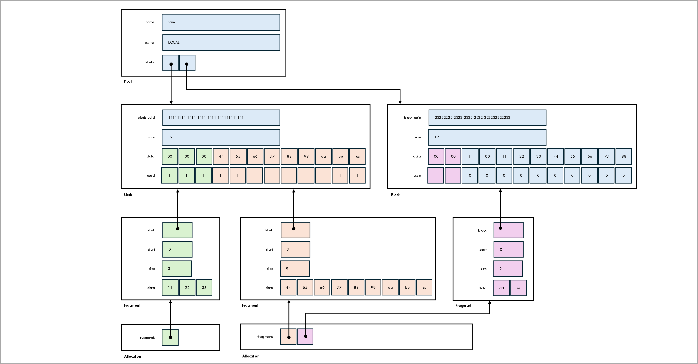

[Back to main page](/dske-python/)

# Developer guide

This page is intended for software developers;
it contains a high-level overview of the implementation.

For an overview of what Distributed Symmetric Key Establishment (DSKE) is and what problem it solves
see the [introduction](what-is-dske-and-what-problem-does-it-solve.md).

For a detailed description of the DSKE protocol, see the
[protocol guide](protocol-guide.md).

If you just want hands-on instructions on how to get started running the code and generating keys
with a minimum of background information see the
[getting started guide](getting-started-guide.md).
Or, for more details see the
[user guide](user-guide.md).

## Technology stack

The code technology stack includes:
* [Python 3.13](https://www.python.org/) as the programming language.
  The nodes (clients and hubs) are asynchronous;
  the manager is synchronous.
* [FastAPI](https://www.python.org/) for server-side HTTP APIs.
* [HTTPX](https://www.python-httpx.org/) for client-side HTTP APIs.
* [Uvicorn](https://uvicorn.dev/)as the ASGI (synchronous Server Gateway Interface) web server.

The development toolchain includes:
* [Git](https://git-scm.com/) and [Github](https://github.com/brunorijsman/dske-python) for version control.
* [Github actions](https://github.com/features/actions) for continuous integration.
* [Pylint](https://pypi.org/project/pylint/) for linting.
* [Black](https://black.readthedocs.io/) for code formatting.
* [Coverage](https://coverage.readthedocs.io/) for code coverage.
* [Pip](https://pypi.org/project/pip/) for dependency management.
* [Venv](https://docs.python.org/3/library/venv.html) for virtual environments.
* [Markdown](https://en.wikipedia.org/wiki/Markdown) for documentation.

## Proof of concept

The code is intended to be a proof-of-concept to study the DSKE protocol; it is not
suitable for  production deployments for numerous reasons (e.g. 
state is not persisted and the protocol needs to start from scratch every time a daemon restarts,
we have made no effort to prevent side-channel attacks,
etc.)

## Check-and-test script

The `check-and-test` bash script in the `scripts` directory does the following:
* Lints the code.
* Checks the formatting of the code.
* Runs all unit tests.
* Runs all system tests.
* Measures code coverage when running the tests.

A Github action workflow runs this script on every push to our repository.

The `--help` option explains it's usage:

<pre>
$ <b>scripts/check-and-test --help</b>
Usage: check-and-test [OPTIONS] [ACTION]

Positional arguments:
  ACTION:
    lint           Lint the code
    format-check   Check code formatting
    test           Run unit tests (including code coverage)

OPTIONS:
  -h, --help: Display this help message
  -v, --verbose: Verbose output
</pre>

When the script finishes it reports whether or not all checks and tests passed.
It also reports a code coverage report summary.
You can open a detailed code coverage report in your browser:

<pre>
$ <b>open htmlcov/index.html</b>
</pre>

## API endpoints

For full and up-to-date documentation of the API endpoints, each network node provides OpenAPI
documentation.
To view the documentation go to URL `http://localhost:PORT/docs` where PORT is the port number
for the network node as reported when the topology is started.

Here we provide a summary of the API endpoints and their purpose.

### API naming conventions

The API endpoints belong to one of the following groups:

| API endpoint URL | Purpose |
|-|-|
| `.../dske/...` | DSKE protocol. |
 | `.../dske/oob/...` | The out-of-band (OOB) portion of the DSKE protocol. |
| `.../dske/api/...` | The in-band portion of the DSKE protocol. |
| `../mgmt/...` | Used to manage the nodes. |

All API endpoints include the node type and the node name at the start of the URL path.
For example:

| Node type | API endpoint URL |
|-|-|
| Hub | `/hub/HUB_NAME/...` |
| Client | `/client/CLIENT_NAME/...` |

Including the node name in the URL is currently not really necessary since each node runs in its
own process on a different HTTP port.
But if this code is run as a cloud-based service (similar to
[QuKayDee](https://qukaydee.com)
for QKD) sitting behind a proxy
(e.g [Nginx](https://nginx.org/)) we can use URL-based routing to dispatch each request to the
correct node process.

All API endpoints are versioned (currently `v1`).

Putting all of this together, an example of a complete URL for one of the API endpoints is:
`/hub/HUB_NAME/dske/api/v1/key-share`

### Hub API endpoints

The hubs provides the following API endpoints:

| Method | URL | Purpose | Authenticated |
|-|-|-|-|
| PUT | `/hub/HUB_NAME /dske/oob/v1 /registration` | Register a client with a hub. | No |
| GET | `/hub/HUB_NAME /dske/oob/v1 /psrd` | A client gets a block of Pre-Shared Random Data (PSRD) from the hub. | No |
| POST | `/hub/HUB_NAME /dske/api/v1 /key-share` | An initiator client adds a key share to the hub. The share can later be retrieved by the responder client. | Yes |
| GET | `/hub/HUB_NAME /dske/api/v1 /key-share` | A responder client retrieves a key share from the hub. The share was previously added by the initiator client. | Yes |
| GET | `/hub/HUB_NAME /mgmt/v1 /status` | Get the management status of the hub. | No |
| POST | `/hub/HUB_NAME /mgmt/v1 /stop` | Stop the hub. | No |

### Clients API endpoints

The clients provides the following API endpoints:

| Method | URL | Purpose | Authenticated |
|-|-|-|-|
| GET | `/client/CLIENT_NAME /etsi/api/v1 /keys/SLAVE_SAE_ID/enc_keys` | An initiator encryptor gets a key from a client. | No |
| GET | `/client/CLIENT_NAME /etsi/api/v1 /keys/MASTER_SAE_ID/dec_keys ?key_ID=KEY_ID` | A responder encryptor gets a key with key ID from a client. | No |
| GET | `/client/CLIENT_NAME /etsi/api/v1 /keys/SLAVE_SAE_ID/status` | An encryptor gets the QKD link status from client. | No |
| GET | `/hub/HUB_NAME /mgmt/v1/status` | Get the management status of the client. | No |
| POST | `/hub/HUB_NAME /mgmt/v1/stop` | Stop the club. | No |

## Authentication

Only the in-band DSKE protocol API endpoints (`.../dske/api/...`) are authenticated
using the authentication mechanism described in the
[protocol guide](protocol-guide.md)

The out-of-band DSKE protocol API endpoints (`.../dske/oob/...`) are not authenticated.
They only exist for the purpose of automated testing, simulating actions that would be some 
secure out-of-band physical distribution mechanism in real life.

The management API endpoints (`../mgmt/...`) are also not authenticated because this implementation
is not intended for production deployment.

And finally, the key delivery API endpoints (`.../etsi/api/...`) are also not authenticated because
we only implement a simplified subset of the
[ETSI QKD 014](https://www.etsi.org/deliver/etsi_gs/QKD/001_099/014/01.01.01_60/gs_qkd014v010101p.pdf)
key delivery interface.

## Pre-Shared Random Data (PSRD) management

Pre-Shared Random Data (PSRD) is a central concept in DSKE.
This section summarizes how PSRD is implemented in the code.

PSRD management is implemented using the classes `Block`, `Pool`, `Fragment`, and `Allocation`.
We describe each of these classes below.
The relationship between these classes are shown in the following figure:



### Class `Block`

The class `Block` represents a block of PSRD bytes that the hub sends to the client.

A client requests one block of PSRD from the hub sending a GET request to the
`/hub/HUB_NAME/dske/oob/v1/psrd` API endpoint.

The `Block` class has the following attributes:

| Attribute | Type | Purpose |
|-|-|-|
| block_uuid | UUID | Uniquely identifies the block. |
| size | int | Size of the block in bytes. |
| data | bytes | The bytes in the block. |
| used | bitarray | A bit for each byte in the block to indicate whether the byte is used (allocated). |

### Class `Pool` ###

The class `Pool` represents a pool of Pre-Shared Random Data (PSRD) from which the DSKE code
make do allocations (see class `Allocation` below).
Once data is allocated, it is zeroed out in the `Pool`.
Each pool has an owner (local or remote); the concept of pool ownership is explained below.
The pools implemented as a sequence of PSRD blocks (`Block` objects).

The `Pool` class has the following attributes:

| Attribute | Type | Purpose |
|-|-|-|
| name | str | The name of the pool (for debugging purposes). |
| blocks | List[Block] | A list of blocks in the pool. |
| owner | local or remote | The owner of the pool (explained below). |


### Class `Fragment`

The class `Fragment` represents a contiguous sequence of bytes within a block that have been
allocated from that block.

The `Fragment` class has the following attributes:

| Attribute | Type | Purpose |
|-|-|-|
| block | Block | A reference to the block from which the fragment was allocated. |
| start | int | The index of the byte within the block for the first byte in the fragment. |
| size | int | The number of bytes in the fragment. |
| data | bytes | A copy of the bytes in the block that have been allocated to the fragment. |

### Class `Allocation` ###

The class `Allocation` represents an allocation of bytes from a PSRD pool (`Pool` object).
It is implemented as a sequence of fragments (`Fragment` objects).
This is needed because the number of bytes that need to be allocated may not be available
as a contiguous sequence of unused (non-allocated) bytes in any block in the pool.
In that case, the allocation algorithm gathers the needed number of bytes using multiple
fragments, each fragment representing a contiguous sequence of bytes.

the `Allocation` class has the following attributes:

| Attribute | Type | Purpose |
|-|-|-|
| fragments | List[Fragment] | The list of fragments that the allocation is composed of. |


### The concept of block ownership

When a hub and a client share a block of Pre-Shared Random Data (PSRD) there is a `Block` object
on the hub side and a `Block` object with the same random data on the client side.
The hub and the client use their blocks to allocate secrets that are shared with their peer.
These shared secrets are used for encryption and authentication of DSKE protocol messages.

In the code, allocating a shared secret means creating an `Allocation` object.
This marks some bytes in some blocks as being allocated and consumed.
Sharing a secret means sending the some information about the `Allocation` object to the peer:
which bytes in which blocks have been allocated, but not the byte values themselves.
The peer then uses this information to create a corresponding `Allocation` object with
identical byte values.

## Message authentication

The DSKE protocol runs over HTTP and not over HTTPS;
it uses its own authentication and encryption mechanisms instead of relying on TLS.

In-band DSKE protocol messages are signed using PSRD data for authentication.

The client signs outgoing HTTP request messages and the hub verifies the signature on incoming
HTTP request messages.
The hub signs outgoing HTTP response message and the client verifies the signature on incoming
HTTP response messages.

The sender of an HTTP message signs outgoing HTTP messages as follows:

 * Allocate a 32 (SIGNING_KEY_SIZE) byte signing key from the local pool associated with the
   received of the message.

 * Compute a SHA256 hash over the concatenation of the allocated signing key and the content of
   the signed HTTP message and the parameters of the request. This hash is used as the signature.

 * Convey both the meta-data of the signing key and also the base64 encoded signature in the
   HTTP header `DSKE-Signature`.
   Below, we explain how all of this information is encoded in an HTTP header string.
   This allows the receiver to allocate the same signing key from the Pre-Shared Random Data
   to verify the signature.

The received of an HTTP message verifies the signature on incoming HTTP messages as follows:

 * Extract the meta-data of the signing key as well as the signature from received HTTP
   header `DSKE-Signature`.

 * Use the meta data to take the signing key value from the pool of Pre-Shared Random Data.

 * Compute a SHA256 hash over the concatenation of the allocated signing key and the content of
   the signed HTTP message and the parameters of the request.
   This hash is the locally computed signature.

 * Compare the locally computed signature with the received signature.
   If they match, the signature is correct.

 * If the signatures do not match, the locally allocated signing key is given back to the pool.
   This is to prevent Denial-of-Service attacks from an attacker guessing singing keys.

The meta-data of the signing key is encoded into the `DSKE-Signature` header as follows:

 * The meta-data of the singing key, followed by a semi-colon (;), followed by the signature
   encoded using base64 encoding.

 * The meta-data of the signing key is encoded as one or more encoded fragment meta-data strings,
   separated by commas.

 * Each fragment meta-data string is encoded as the block UUID, the start byte within the block,
   and the size of the fragment, separated by colons.

 * Note that the key data (fragment data) is not encoded into the meta-data.

Example of an encoded signature:

```
9ad7f620-5a0c-4979-8a2d-66142e06fd79:0:20,cda527e9-5ca7-40d6-a842-0b606597611c:0:12;V12fwNZiooqE1x0beAdQ4fo2YXnOCTPbUgqG38eUQc4=
```

The part after the semi-colon is the base64-encoded signature:

```
V12fwNZiooqE1x0beAdQ4fo2YXnOCTPbUgqG38eUQc4=
```

The part before the semi-colon is the sequence of two fragments:

```
9ad7f620-5a0c-4979-8a2d-66142e06fd79:0:20,cda527e9-5ca7-40d6-a842-0b606597611c:0:12
```

The first fragment is bytes 0 through 19 of block 9ad7f620-5a0c-4979-8a2d-66142e06fd79:

```
9ad7f620-5a0c-4979-8a2d-66142e06fd79:0:20
```

And the second fragment is bytes 0 through 11 of block cda527e9-5ca7-40d6-a842-0b606597611c:

```
cda527e9-5ca7-40d6-a842-0b606597611c:0:12
```

The signatures have to be computed over the body of the HTTP message, exactly as it is encoded
in the HTTP message.
This was non-trivial to implement in the code.

On the client side, we use the Python
[httpx](https://www.python-httpx.org/)
module.
On the server (hub) side, we use the Python
[FastAPI](https://fastapi.tiangolo.com/)
module.
Both modules try to make life easier for the developer by allowing the code to use Python objects
(instead of raw bytes or strings) to represent the body of a message.
However, to compute the signature we needed the exact encoded bytes in the HTTP message, not
its representation as a Python object.
We could have tried to work with canonical encoders/decoders, but that would be complex and
error-prone.
Instead, we used a different mechanism to get access to the encoded message body and
compute/verify the signature over it.

On the client (httpx) side, we use the 
[per-request authentication mechanism](https://www.python-httpx.org/advanced/authentication/)
to register a `async_auth_flow` callback.
This callback is called after the message is encoded but before it is sent.
This allows us to compute the signature and add the `DSKE-Signature` header on the outgoing
HTTP request.

On the hub (server, FastAPI) side, we use the
[Starlette middleware mechanism](https://www.starlette.dev/middleware/).
We register the `dske_authentication` function as a middleware for HTTP.
This gives us access to the body in a request before decoding and the body in a response
before encoding.

However, when we are in the middleware code, it is too late to allocate
a signing key from the PSRD pool. For this reason, the signing key is allocated in the main
application logic code and passed to the middleware using a temporary HTTP header
`DSKE-Signing-Key`. 
The middleware extracts the signing key from the temporary header, uses it to compute the 
signature, adds the `DSKE-Signature` header, and removes the temporary `DSKE-Signing-Key` header.

## Share encryption

TODO
