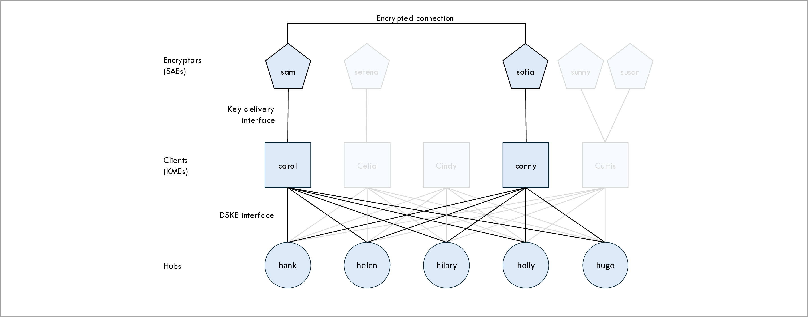
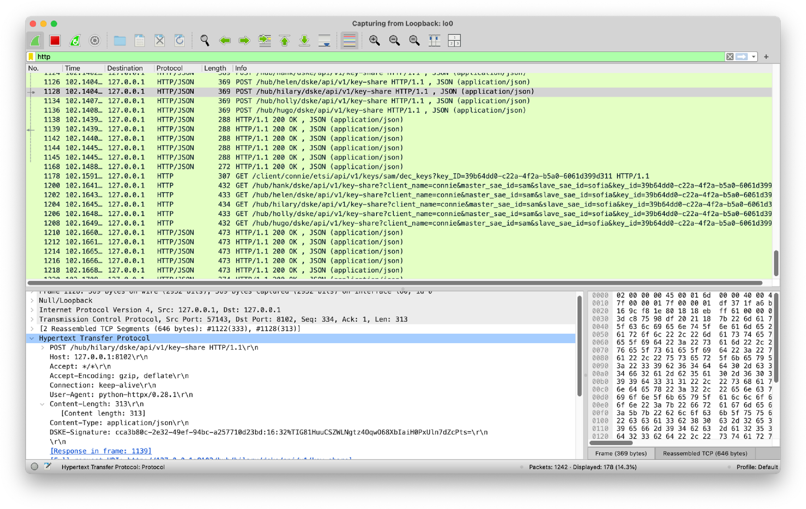

[Back to main page](/dske-python/)

# Getting started guide

This chapter is intended for readers who just want to get started actually running the code
without any background information.
We walk you through the steps for installing the code and producing some keys
using the Distributed Symmetric Key Establishment (DSKE) protocol.

For an overview of what DSKE is and what problem it solves see the
[introduction](what-is-dske-and-what-problem-does-it-solve.md).

For a detailed description of the DSKE protocol, see the
[protocol guide](protocol-guide.md).

For full reference documentation for the commands used in these steps, see the
[user guide](user-guide.md).

If you are a software developer and would like more details about the implementation, see the
[developer guide](developer-guide.md).

## Installation

Clone the repository:

```
git clone https://github.com/brunorijsman/dske-python.git
```

Change directory to the cloned repository:

```
cd dske-python
```

We use Python 3.13 to develop and test the code.
Install Python 3.13 including venv (if needed):

```
sudo add-apt-repository ppa:deadsnakes/ppa
sudo apt-get install python3.13
sudo apt-get install python3.13-venv
```

Install pip (if needed):

```
sudo apt-get install pip
```

Create a virtual environment:

```
python3.13 -m venv venv
```

Activate the virtual environment:

```
source venv/bin/activate
```

Install de dependencies:

```
pip install -r requirements.txt
```

## The example topology

View the example topology file `topology.yaml`:

```
$ cat topology.yaml
hubs:
  - name: hank
  - name: helen
  - name: hilary
  - name: holly
  - name: hugo
clients:
  - name: carol
    encryptors:
      - name: sam
  - name: celia
    encryptors:
      - name: serena
  - name: cindy
  - name: connie
    encryptors:
      - name: sofia
  - name: curtis
    encryptors:
      - name: sunny
      - name: susan
```

This is a diagram of the topology:



## The `manager.py` script

The `manager.py` is used to manage topologies.
Use the `--help` option to see how it is used:

```
$ ./manager.py topology.yaml --help
usage: manager.py [-h] [--client CLIENT | --hub HUB] configfile {start,stop,status,etsi-qkd} ...

DSKE Manager

positional arguments:
  configfile            Configuration filename
  {start,stop,status,etsi-qkd}
    start               Start all hubs and clients
    stop                Stop all hubs and clients
    status              Report status for all hubs and clients
    etsi-qkd            ETSI QKD operations

options:
  -h, --help            show this help message and exit
  --client CLIENT       Filter on client name
  --hub HUB             Filter on hub name
```

## Start WireShark

Optionally, if
[WireShark](https://www.wireshark.org/)
is installed on your computer, start it now so that you can view the protocol in action.
Start a capture on loopback interface `lo0` and filter on HTTP messages.


## Start the example topology

Use the `manager.py` script to start the topology:

```
$ ./manager.py topology.yaml start
Waiting for all nodes to be stopped
Starting hub hank on port 8100
Starting hub helen on port 8101
Starting hub hilary on port 8102
Starting hub holly on port 8103
Starting hub hugo on port 8104
Starting client carol on port 8105
Starting client celia on port 8106
Starting client cindy on port 8107
Starting client connie on port 8108
Starting client curtis on port 8109
Waiting for all nodes to be started
```

## Explore the Swagger documentation

Explore the Swagger documentation for the node's REST interface.
Each node (i.e. each client and each hub) runs in a separate process and is listening
on a separate HTTP port as reported in the output when the topology was started.
For example, hub hank is listening on HTTP port 8100.
To view the Swagger API documentation for hub hank open a browser and go to URL
`http://localhost:8100/docs`


## Create key pair between encryptors Sam and Sofia

Use the `manager.py` script to create a key pair between encryptors Sam and Sofia using the
ETSI QKD 014 interface.
You will get different key IDs and key values, but they should match.


```
$ ./manager.py topology.yaml etsi-qkd sam sofia get-key-pair
Invoke ETSI QKD Get Key API on client (KME) carol port 8105 master encryptor (SAE) sam slave encryptor (SAE) sofia:
{
  "keys": {
    "key_ID": "39b64dd0-c22a-4f2a-b5a0-6061d399d311",
    "key": "xVXO2xSlhSIrkpw5kfWPog=="
  }
}
Invoke ETSI QKD Get Key with Key IDs API on client (KME) connie port 8108 master encryptor (SAE) sam slave encryptor (SAE) sofia:
{
  "keys": [
    {
      "key_ID": "39b64dd0-c22a-4f2a-b5a0-6061d399d311",
      "key": "xVXO2xSlhSIrkpw5kfWPog=="
    }
  ]
}
Key values match
```

## Explore the protocol messages in WireShark

You can explore the protocol messages in WireShark:
The protocol is explained in the [protocol guide](protocol-guide.md).



## Display the internal state of a node

Use the `manager.py` script to view the internal state of a node, in this case client carol:

```
$ ./manager.py topology.yaml --client carol status
Status for client carol on port 8105
{
  "name": "carol",
  "encryptor_names": [
    "sam"
  ],
  "peer_hubs": [
    {
      "hub_name": "hank",
      "registered": true,
      "local_pool": {
        "blocks": [
          {
            "uuid": "8f4db917-1047-420f-bc95-f11ef030014d",
            "size": 2000,
            "data": "AAAAAAAAAAAAAA==...",
            "nr_used_bytes": 48,
            "nr_unused_bytes": 1952
          }
        ],
        "owner": "local"
      },
      "peer_pool": {
        "blocks": [
          {
            "uuid": "aa983eb2-9ae6-4c1f-8be1-258dfa96bb2d",
            "size": 2000,
            "data": "AAAAAAAAAAAAAA==...",
            "nr_used_bytes": 32,
            "nr_unused_bytes": 1968
          }
        ],
        "owner": "peer"
      }
    },
    ...
  ]
}
```

## Stop the topology

Use the `manager.py` script to stop the topology:

```
$ ./manager.py topology.yaml stop
Stopping client curtis on port 8109
Stopping client connie on port 8108
Stopping client cindy on port 8107
Stopping client celia on port 8106
Stopping client carol on port 8105
Stopping hub hugo on port 8104
Stopping hub holly on port 8103
Stopping hub hilary on port 8102
Stopping hub helen on port 8101
Stopping hub hank on port 8100
Waiting for all nodes to be stopped
```

## View the `.out` file for a node:

View the `.out` file for a node, in this example client Carol.
It contains logs and debugging information.
Your output may look different.

```
$ cat client-carol.out
INFO:     Started server process [24907]
INFO:     Waiting for application startup.
INFO:     Begin register task for peer hub None
INFO:     Begin register task for peer hub None
INFO:     Begin register task for peer hub None
INFO:     Begin register task for peer hub None
INFO:     Begin register task for peer hub None
INFO:     Application startup complete.
INFO:     Uvicorn running on http://127.0.0.1:8105 (Press CTRL+C to quit)
INFO:     Call PUT http://127.0.0.1:8100/hub/hank/dske/oob/v1/registration 200
INFO:     Finish register task for peer hub None
INFO:     Call PUT http://127.0.0.1:8103/hub/holly/dske/oob/v1/registration 200
INFO:     Call PUT http://127.0.0.1:8102/hub/hilary/dske/oob/v1/registration 200
INFO:     Call PUT http://127.0.0.1:8104/hub/hugo/dske/oob/v1/registration 200
INFO:     Call PUT http://127.0.0.1:8101/hub/helen/dske/oob/v1/registration 200
INFO:     Begin request PSRD task for peer hub hank and pool owner local
INFO:     Begin request PSRD task for peer hub hank and pool owner peer
INFO:     Finish register task for peer hub None
INFO:     Finish register task for peer hub None
INFO:     Finish register task for peer hub None
INFO:     Finish register task for peer hub None
INFO:     Begin request PSRD task for peer hub holly and pool owner local
INFO:     Begin request PSRD task for peer hub holly and pool owner peer
INFO:     Begin request PSRD task for peer hub hilary and pool owner local
INFO:     Begin request PSRD task for peer hub hilary and pool owner peer
INFO:     Begin request PSRD task for peer hub hugo and pool owner local
INFO:     Begin request PSRD task for peer hub hugo and pool owner peer
INFO:     Begin request PSRD task for peer hub helen and pool owner local
INFO:     Begin request PSRD task for peer hub helen and pool owner peer
INFO:     Call GET http://127.0.0.1:8100/hub/hank/dske/oob/v1/psrd?client_name=carol&pool_owner=client&size=2000 200
INFO:     Finish request PSRD task for peer hub hank and pool owner local
INFO:     Call GET http://127.0.0.1:8100/hub/hank/dske/oob/v1/psrd?client_name=carol&pool_owner=hub&size=2000 200
...
INFO:     Call POST http://127.0.0.1:8104/hub/hugo/dske/api/v1/key-share 200
INFO:     Successfully scattered 5 out of 5 shares for key ID 0aa99444-fddc-44d2-ac23-49657e5e6021
INFO:     127.0.0.1:57301 - "GET /client/carol/etsi/api/v1/keys/sofia/enc_keys HTTP/1.1" 200 OK
INFO:     127.0.0.1:57318 - "POST /client/carol/mgmt/v1/stop HTTP/1.1" 200 OK
INFO:     Shutting down
INFO:     Waiting for application shutdown.
INFO:     Application shutdown complete.
INFO:     Finished server process [24907]
```