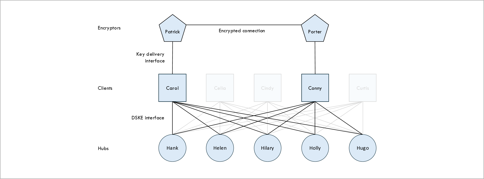
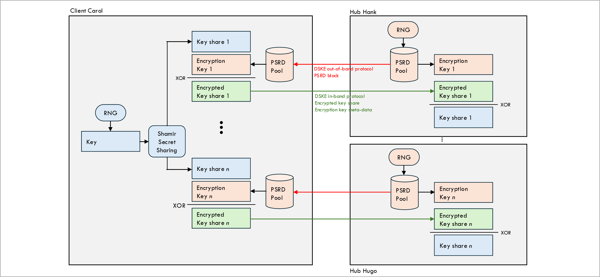
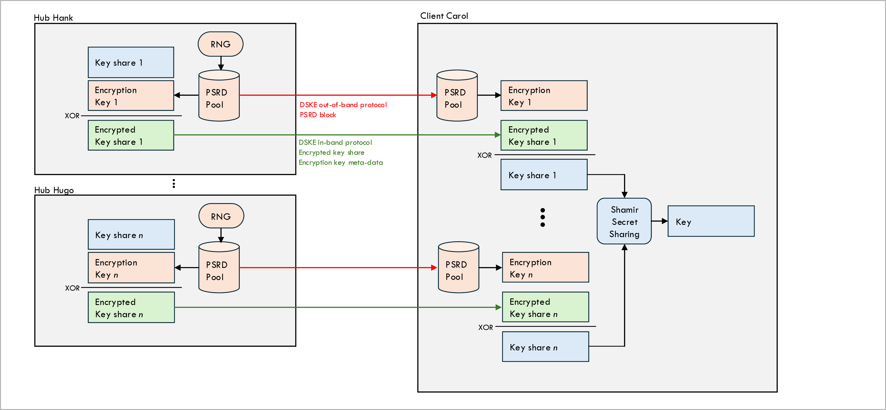
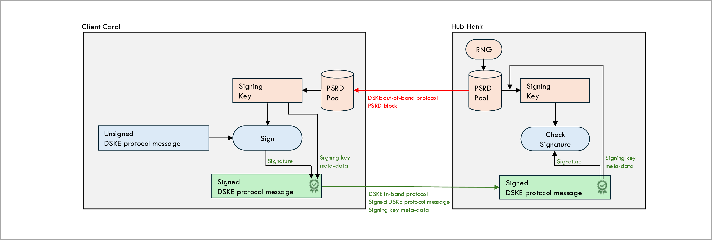
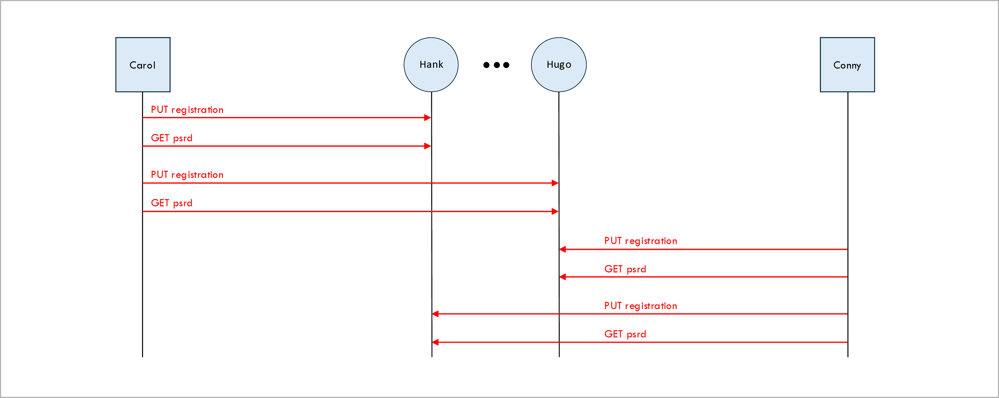
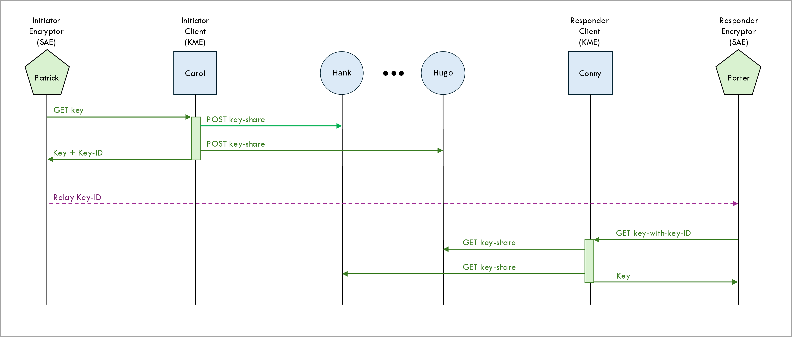

[Back to main page](/dske-python/)

# Protocol guide

This chapter describes the Distributed Symmetric Key Establishment (DSKE) protocol as it is
implemented in this repository.

If you are not yet familiar with the concepts of quantum-safe security, Post Quantum Cryptography
(PQC) or Quantum Key Distribution (QKD), it is helpful to first read the introduction:
[what is DSKE and what problem does it solve?](/what-is-dske-and-what-problem-does-it-solve.md).

## Inspiration

Our DSKE implementation is inspired by:

* IETF Internet Draft draft-mwag-dske-02<br>
  Distributed Symmetric Key Establishment (DSKE).<br>
  [https://datatracker.ietf.org/doc/draft-mwag-dske/02/](https://datatracker.ietf.org/doc/draft-mwag-dske/02/)

 * Paper arXiv:2205.00615:<br>
   Distributed Symmetric Key Establishment: A scalable, quantum-proof key distribution system.<br>
   [https://arxiv.org/abs/2205.00615](https://arxiv.org/abs/2205.00615)

 * Paper arXiv:2304.13789<br>
   Composable Security of Distributed Symmetric Key Establishment Protocol.<br>
   [https://arxiv.org/abs/2304.13789](https://arxiv.org/abs/2304.13789)

We say "inspired by" because:

 * The draft and the paper only describe the general approach.
   They do not describe the protocol in sufficient detail for an unambiguous interoperable
   implementation.
   For example, the draft and the paper do not specify message formats or finite state machines.

 * Our implementation deviates from the draft and the paper in some aspects.
   Sometimes, we found it difficult to follow the details in the description.
   Other times, the description was clear enough, but we made a conscious decision to deviate.
   A list of differences between the draft/paper and this implementation is given
   [below](#differences-between-the-ietf-draft-and-this-implementation).

## TODO: Add DSKE overview

## Network topology

The following figure shows a typical example network topology:



The topology consists of the following types of nodes:
* Clients.
* Hubs.
* Encryptors.

### Clients

The DSKE client nodes, or just clients for short, are represented by blue squares in the topology
diagram above.
Standard
[IETF ETSI QKD 014](https://www.etsi.org/deliver/etsi_gs/QKD/001_099/014/01.01.01_60/gs_qkd014v010101p.pdf)
uses the term Key Management Entity (KME) instead of client.

There are five clients in our example: Carol, Celia, Cindy, Conny, and Curtis.

The clients are responsible for:

1. Registering themselves with hubs.

2. Requesting Pre-Shared Random Data (PSRD) from hubs when needed.

3. Establishing keys and delivering those keys to encryptors upon request.

4. Splitting keys into key shares and relaying those keys shares from client to client through a set
   of hubs.

Below, we describe the concepts of PSRD and key shares and each of these steps in more detail.

In the example scenario, clients Carol and Conny are responsible for producing an encryption key
and for delivering this key to encryptors Patrick and Porter respectively.
The other clients are faded out because they play no role in our example.

In our implementation, each client runs in a separate process, listening on a separate
HTTP port.

### Hubs

The the DSKE hub nodes, or just hubs for short, are represented by blue circles in the topology
diagram above.
IETF draft
[draft-mwag-dske-02](https://datatracker.ietf.org/doc/draft-mwag-dske/02/)
uses the term security hub.

There are five hubs in our example: Hank, Helen, Hilary, Holly, and Hugo.

The hubs are responsible for:

1. Allowing clients to register themselves with the hubs.

2. Distributing Pre-Shared Random Data (PSRD) to clients upon request.

3. Relaying key shares from client to client.

Once again, we describe these steps in more detail below.

In the example scenario, all five hubs are involved in relaying the key shares between clients Carol
and Conny.

In our implementation, each hub also runs in a separate process, listening on a separate HTTP port.

### Encryptors

The encryptors are the devices that consume the keys that are produced by the clients and use them
to encrypt user traffic that is sent through a encrypted connection.
[IETF ETSI QKD 014](https://www.etsi.org/deliver/etsi_gs/QKD/001_099/014/01.01.01_60/gs_qkd014v010101p.pdf)
uses the term Secure Application Entity (SAE) instead of encryptor.

Examples of encryptors include:
* [Optical](https://en.wikipedia.org/wiki/Optical_transport_network)
  encryptors, such as
  [Ciena WaveLogic](https://www.ciena.com/solutions/data-security-and-encryption).
* [MACsec](https://en.wikipedia.org/wiki/IEEE_802.1AE) encryptors, such as
  [Juniper QFX switches](https://www.juniper.net/us/en/products/switches/qfx-series.html).
* [IPsec](https://en.wikipedia.org/wiki/IPsec) encryptors, such as
  [FortiNet FortiGate Next-Generation Firewalls](https://www.fortinet.com/products/next-generation-firewall).
* [TLS](https://en.wikipedia.org/wiki/Transport_Layer_Security) /
  [SSL](https://en.wikipedia.org/wiki/Secure_Sockets_Layer) encryptors, such as
  [F5 NGINX](https://www.f5.com/company/blog/nginx/nginx-ssl).

There are two encryptors in our example: Patrick and Porter.

The encryptors are responsible for:

1. Requesting an encryption key from the clients (they may periodically request a fresh key for
   key roll-overs).

2. Use that encryption key to encrypt the user data that is sent over the encrypted connection.

In our implementation, the `manager.py` script takes on the role of the encryptors, invoking the
ETSI QKD 014 interface to request keys from the clients.

### Local distributors

The IETF draft has more more type of node: local distributors.
We have not implemented local distributors; hubs deliver PSRD directly to clients without
local distributors in between.

### Connectivity

The topology diagram above contains lines that represent the connectivity between the various
network nodes (clients, hubs, encryptors).
These lines are not intended to represent single-hop point-to-point physical connections.
Instead they represent potentially multi-hop IP connectivity between the network nodes; each link
may contain multiple switch or router hops.

## Interfaces

The topology contains the following software interfaces:
* DSKE interface (in-band and out-of-band).
* Key delivery interface.
* Management interface.

### DSKE interface

The DSKE interface is the interface between the clients and the hubs.
The clients and hubs run the DSKE protocol over this interface.
Using the DSKE protocol, the clients and the hubs collaborate with each other to establish the keys.

### Key delivery interface

The key delivery interface is the interface between the clients and the encryptors.
The encryptors use the key delivery interface to retrieve keys from the clients.

There are two standard key delivery protocols:

1. [ETSI QKD 014](https://www.etsi.org/deliver/etsi_gs/QKD/001_099/014/01.01.01_60/gs_qkd014v010101p.pdf)
   is standardized by
   [ETSI](https://www.etsi.org/).
   This protocol is supported by multiple encryptor devices from different vendors.

2. The Secure Key Integration Protocol (SKIP) is defined in IETF draft
   [IETF draft draft-cisco-skip](https://datatracker.ietf.org/doc/draft-cisco-skip).
   This protocol is supported by some Cisco encryptors.

The code in this repository uses a simplified implementation of ETSI QKD 014.
The point of this repository is not to have a full-blown implementation of ETSI QKD 014 but
rather to implement the DSKE protocol.
See
[QuKayDee](https://qukaydee.com/)
or
[qkd_kme_server](https://github.com/thomasarmel/qkd_kme_server)
if you want to get experience with the ETSI QKD 014 protocol.

### Management interface

This repository contains a management script (`manager.py`) that is used to control the network
nodes.
It can start nodes, stop nodes, report the status of nodes, and request keys.
See the
[getting started guide](getting-started-guide.md)
or the
[user guide](user-guide.md)
for more information.
The clients and the hubs expose a management interface, which is a REST API, to interact with the
management script.

## Shamir's Secret Sharing (SSS)

Before we describe the DSKE protocol, we first describe
[Shamir's Secret Sharing (SSS)](https://en.wikipedia.org/wiki/Shamir%27s_secret_sharing)
algorithm, which is an essential component in the DSKE protocol.

Shamir's Secret Sharing allows a secret to be split up into some number (_n_) of parts.
Each part is called a share of the secret.
The original secret can be reconstructed if you have at least _k_ out of the original _n_ shares
(were _k_ is some number smaller than _n_).
If you have fewer than _k_ shares, no information about the secret can be extracted.

In the DSKE protocol, the key that is established for the encryptors is the secret.
The key is split up into _n_ key shares, where _n_ is the number of hubs.
Each key share is relayed from the initiator client to the responder client through a different hub.

As a result of this arrangement:
1. An attacker needs to compromise at least _k_ hubs to recover the key.
2. The protocol is resilient against failures or denial-of-service attacks as long as at least
   _k_ hubs survive.

## Out-of-band versus in-band

Certain steps of the DSKE protocol, as described in the IETF draft, are not part of the DSKE
protocol per-se.
Instead, these steps are implemented using some secure mechanism that is outside of the scope of
the DSKE protocol itself.
We refer to these steps as out-of-band steps;
in ladder diagrams they are shown in red.
We refer to the steps that are actually part of the DSKE protocol itself as in-band steps;
in ladder diagrams they are shown in green.

The out-of-band steps include:
1. Clients registering themselves with hubs.
2. Hubs delivering Pre-Shared Random Data (PSRD) to clients.

The IETF draft gives some examples of how the out-of-band steps could be implemented in real life,
including physical delivery using Hardware Security Modules (HSMs), encrypted USBs, 
military
[key transfer devices](https://www.cryptomuseum.com/crypto/fill.htm)
, SIM cards, NFC, QKD, etc.

In our code we implement the out-of-band DSKE interface as an HTTP REST interface.
In real life HTTP would not be used for this purpose; instead some secure
physical delivery mechanism would be used, as we just mentioned.
We use HTTP as a simulation of this physical mechanism to enable automated testing of use case
scenarios.

Our code also implements the in-band DSKE interface as an HTTP REST interface.
This REST interface runs over normal HTTP and not over HTTPS.
The DSKE protocol uses its own authentication and encryption mechanisms which are described
below.

## Pre-Shared Random Data (PSRD)

The concept of Pre-Shared Random Data (PSRD) plays a central role in the DSKE protocol.

Each client and each hub use some secure out-of-band mechanism to agree on large blocks of random
data, which we refer to as PSRD blocks.
The data is completely random and meaningless and should be generated by a high-quality entropy
source, for example a Quantum Random Number Generator (QRNG).
These blocks of PSRD can be very large, e.g. many gigabytes.

The random data in the PSRD blocks is consumed by the clients and by the hubs for the purpose
of authenticating DSKE protocol messages and for encrypting specific fields (namely the key shares)
in DSKE protocol messages.

Each byte of PSRD is used once and once only.
The PSRD is essentially used for One Time Pad (OTP) encryption, which contributes to the
Information Theoretic Security (ITS) of the protocol.

When the clients or the hubs run low on PSRD, there is an out-of-band mechanism for the clients
to request additional blocks of PSRD from the hubs.

In the code, each block of PSRD is represented by a `Block` object.
Each block is uniquely identified by a Universally Unique Identifier (UUID).

The clients and the hubs may have exchanged multiple PSRD blocks.
The pool of available PSRD blocks is represented by a `Pool` object.

When a client or a hub needs to authenticate or encrypt a DSKE message, it allocates
some bytes from the pool.
In the code, such an allocation is represented by an `Allocation` object.

An allocation may consist of multiple fragments from different blocks.
This happens when an allocation requests more bytes than are remaining in a block.
These fragments are represented in the code by `Fragment` objects.

One of the fundamental ideas in the DSKE protocol is that a given client and a given hub
can agree on a shared secret by exchanging the meta-data (and only the meta-data, not the data
itself) for an allocation.

As a simplified example, the client and the hub might agree to use an allocation that consists
of bytes 100 to 200 of PSRD block 11111111-2222-3333-4444-555555555555.
Given the range of bytes and the block UUID, both the client and the hub are able to retrieve the
shared secret data from their pool.
But any attacker cannot retrieve the shared secret data because the data itself is never on the wire
(only the meta-data) and the attacker does not have access to the PSRD.

For more details about the implementation see the [developer guide](developer-guide.md).

## Key relaying

The following two figures show how the DSKE protocol establishes a key between two clients Carol
and Conny.

Before they establish a key, client Carol and Conny have already obtained blocks of PSRD from
each hub using the DSKE out-of-band protocol (these are the red lines in the figures).



The figure above shows the first half of the relaying process, namely relaying key shares
from a client Carol to all hubs.

 * Client Carol uses a Random Number Generator (RNG) to generate the key that she wishes to share
   with client Conny.

 * Client Carol uses Shamir's Secret Sharing (SSS) algorithm to split the key into _n_ key shares
   (or just shares for short), where _n_ is the number of hubs that is going to be used to relay
   the key.

 * Client Carol is going to send each share to a different hub, so that the hub can relay the share
   to the remote client Conny (second figure).

 * However, before client Carols sends a share to a particular hub, she first encrypts the share
   using an encryption key that is allocated from the PSRD pool associated with that particular
   hub.

 * When client Carol sends the encrypted key share to a hub, she includes the meta-data about the
   encryption key to the hub.
   This allows the hub to retrieve the exact same decryption key from its local copy of the PSRD
   pool.
   The encryption key value itself is never on-the-wire; only it's public metadata.

Note that the blue keys are different keys than the red keys in the figures.
The blue keys are the user keys that will be delivered to the encryptors.
These are split into key shares for relaying across the hubs.
The red keys are key share encryption keys.
These are allocated from the PSRD pools.



The figure above shows the second half of the relaying process, namely relaying key shares
from all hubs to client Conny.

 * Client Conny receives and encrypted key share from each hob (to be more precise: from at least
   _k_ out of the _n_ hubs).

 * Along with the encrypted key share, the DSKE protocol message also contains meta-data about
   the encryption key that the hub used to encrypt the key share.

 * Client Conny uses this meta-data to allocate the description key from the PSRD pool associated
   with that particular hub and decrypt the encrypted message share.

 * Client Conny uses Shamir's Secret Sharing algorithm to reconstruct Carol's key from the
   decrypted key shares.

## Trusted Relay Nodes (TRNs)

In Quantum Key Distribution (QKD) there is the concept of Trusted Relay Nodes (TRNs).
Each QKD link has a maximum distance, and when you need to generate a QKD key across a greater
distance a trusted relay node can be used to relay the key.

The following figure shows how a trusted relay node works: the trusted relay node uses the red B-C
key to encrypt the green A-B node and relay it to node C.
After the relay is completed, the green A-B key becomes the end-to-end A-C key.


The problem with this approach is that the final A-C key (the green key) is not only known
by the end-points A and C but also by the relay node B.
You have to _trust_ that relay node B will not abuse or leak knowledge of the end-to-end key.
This is why B is called a _trusted_ relay node.

In Distribute Symmetric Key Encryption (DSKE) the problem of having to trust relay nodes is
addressed using Shamir's Secret Sharing (SSS).
The secret key is split into _n_ key shares.
Each hub (which is a relay node) only knows one share of the key.
At least _k_ hubs would have to conspire with each other to be able to gain any knowledge of
the complete key.

Similarly, attacker Eve would have to hack at least _k_ hub nodes and recover _k_ shares to be
recover the secret user key.
Note that only applies to hub nodes and not to links;
even if attacker Eve hacks all _n_ client-to-hub links and taps all `POST key-share` and
all `GET key-share` messages, she is still not able to recover the secret user key
because the key shares in the messages are One-Time-Pad (OTP) encrypted using encryption
keys allocated from Pre-Shared Random Data (PSRD).

This same mechanism also provides resilience to the DSKE protocol:
as long as there are _k_ surviving hub nodes, the DSKE protocol continues to work in the face
of hub failures (i.e. _n_ - _k_ hubs can fail).

## Message authentication


To protect against
[Man-in-the-middle attacks](https://en.wikipedia.org/wiki/Man-in-the-middle_attack)
all in-band DSKE protocol message must be
[authenticated](https://en.wikipedia.org/wiki/Authentication).



The above figure shows how messages sent from clients to hubs are authenticated
(messages sent from hubs to clients are authenticated in a similar way).

Client Carol signs sent messages as follows:

 * Client Carol wants to authenticate an in-band DSKE protocol message for hub Hank.
   This in-band DSKE message is an HTTP REST message that may contain query parameters and/or
   a message body.

 * Client Carol allocates a signing key from the PSRD pool associated with hub Hank.

 * Client Carol computes the signature for the message in the form of a
   [Hashed Message Authentication Code (HMAC)](https://en.wikipedia.org/wiki/HMAC)
   using the message to be signed and the allocated signing key as inputs.
   The HMAC signature is computed over the query parameters and the body of the signed message.

 * Client Carol attaches the computed singing key to the message using the HTTP
   header `DSKE-Signature`.
   This produces a signed message.

 * The `DSKE-Signature` header does not only contain the signature itself (i.e. the HMAC code)
   but also meta-data about the signature key.

Hub Hank validates the signature on received messages as follows:

 * Hub Hank extracts the following two piece of information from the `DSKE-Signature` header
   on the received message: (a) the meta-data for the signing key and (b) the HMAC signature.

 * Hub Hank retrieves the signing key from the PSRD pool associated with client Carol using
   the signing key meta-data extracted from the `DSKE-Signature` header.

 * Hub Hank performs its own local computation of the signature by computing the HMAC over
   the message received from Client Carol and the singing key retrieved from its local PSRD pool.

 * If the locally computed signature matches the received signature, the authentication succeeds.

Note that we don't authenticate out-of-band DSKE messages because the out-of-band REST messages are
only intended to simulated what would be a secure physical mechanism in real for automated testing
purposes.

## Pool ownership

So far, we have seen several scenarios where a node (i.e. a client or a hub) allocates a key from
a local PSRD pool and uses that key to encrypt a key share or to sign a DSKE message.
The node then sends meta-data about the allocated key to a peer node.
This allows the peer node to use the received key meta-data to retrieve the same key from its local
PSRD pool and use that key to decrypt the key share or to validate the signature.

Sometimes the node who allocates the key and sends the meta-data is a client and other times it
is a hub.
This leads to a race condition:
when two nodes (a client and hub) send a message to each other at roughly the same time,
it may happen that they allocate the same bytes from the PSRD pool.
When they receive the meta-data from their peer, they find that the bytes indicated in the received
meta-data are already allocated for a different purpose.

We solve this problem by having each node keep two separate PSRD pools: one pool from which the
client allocates bytes and a different pool from which the hub allocates bytes.
We refer to this as the concept of pool ownership: each PSRD pool is owned by either the client or
the hub.

## Client onboarding

Now that we have explained the basic concepts behind the DSKE protocol, we are finally ready to
describe the actual protocol in detail.
We start with client onboarding.

The following ladder diagram shows the onboarding of a new client in the network.
Note that all the steps in the ladder diagram are red, which means that they are all
[out-of-band](#out-of-band-versus-in-band)
steps.



The steps for onboarding a new client into the network are as follows:

1. The client registers itself with each hub.

2. The client requests its initial block of Pre-Shared Random Data (PSRD) from each hub.

### Client registration

The first thing a client does after it starts up is to register itself with _each_ hub.
In the above example, both client Carol and client Conny register themselves with each of the five
hubs  Hank, Helen, Hilary, Holly, and Hugo.

The client knows which hubs to register itself with because the list of hub URLs is provided to the
client process as a command-line argument when it starts up.
In the current implementation, the hub is not provided with a lists of clients; it simply allows
any client to register itself.

If the hub is not yet running, the registration will fail.
In that case, the client periodically keeps retrying the registration.

The client registration is an HTTP PUT message.
As a result, the client registration is idem-potent and it is not an error for a client to register
itself multiple times. This can happen, for example, when a client crashes and restarts.

In the request, the client provides its own `client_name`.
In the response, the hub provides its `hub_name`.

Method: `PUT`

URL: `/hub/{hub_name}/dske/oob/v1/registration`

Request body:
```
{
  "client_name": "string"   # The name of the client.
}
```

Successful response body:
```
{
  "hub_name": "string"   # The name of the hub.
}
```

Note that we include the node name (in this case `hub_name`) in the path of the URL;
this allows deployments where all nodes run on a single server on a single port 
behind a reverse proxy (e.g. 
[NGINX](https://nginx.org/)
)
where the reverse proxy uses the node name in the URL to dispatch the request to the correct
process.

### Request Pre-Shared Random Data (PSRD)

Once a client has successfully registered itself with a particular hub, it requests its initial
blocks of Pre-Shared Random Data (PSRD) from that hub.
It requests one initial client-owned PSRD block and it requests one initial hub-owned PSRD block
(see discussion of PSRD block ownership above).

Each node consumes data from the PSRD blocks for key-share encryption and for message
authentication.
When a PSRD block nears the point of being fully consumed, the client will request a new PSRD block
to replenish the pool of PSRD data.

Method: `GET`

URL: `/hub/{hub_name}/dske/oob/v1/psrd`

Query parameters:

| Name | Type | Description |
|---|---|---|
| ```client_name``` | string | The client name. |
| ```owner``` | string | The owner of the PSRD block: `client` or `hub`. See discussion of PSRD block ownership above. |
| ```size``` | integer | The size in bytes of the requested PSRD block. |

Request body: None

Successful response body:
```
{
  "block_uuid": "string",   # A UUID chosen by the hub to uniquely identify the PSRD block.
  "data": "string"          # The random bytes in the PSRD block, as a base64 encoded string.
}
```
## Key establishment

The following ladder diagram shows the establishment of a new key:



### Initiator and responder roles

In the example scenario shown in the above ladder diagram, encryptors Patrick and Porter establish
a key.

In each key establishment one of the two encryptors (Patrick in this example) is the initiator:
he initiates the key establishment process.
The other encryptor encryptor (Porter) is the responder: he follows the lead of the initiator.

[ETSI GS QKD 014 V1.1.1 (2019-02)](https://www.etsi.org/deliver/etsi_gs/QKD/001_099/014/01.01.01_60/gs_qkd014v010101p.pdf) still uses the terms master Secure Application Entity (SAE) and slave SAE.
These terms master and slave will be updated to initiator and responder in version `v2` of the
API which is expected to be published soon.

### Initiator encryptor gets key

The initiator encryptor (Patrick) the initiates the key establishment process by invoking the
`Get key` API as defined in section 5.3 of
[ETSI GS QKD 014 V1.1.1 (2019-02)](https://www.etsi.org/deliver/etsi_gs/QKD/001_099/014/01.01.01_60/gs_qkd014v010101p.pdf).

The client-side of this API call is implemented in the manager script `manager.py` and the
server-side is implemented by the client node.
(The naming is confusing here - the client node is called that because it is the client-side of
the client-hub interface.)

We only implement a minimal subset of the ETSI QKD 014 interface - the point of this repository
is to demonstrate a DSKE protocol, not to have a fully compliant ETSI QKD 014 implementation.
See
[QuKayDee](https://qukaydee.com)
or
[qkd_kme_server](https://github.com/thomasarmel/qkd_kme_server)
if you want to experiment with a full ETSI QKD 014 implementation.

Method: `GET`

URL: `/client/{client_name}/etsi/api/v1/keys/{slave_SAE_ID}/enc_keys`

Note that this API call always referred to as the `Get key` API call, but the URL path
actually ends in `enc_keys`.

URL parameters: 

| Name | Type | Description |
|---|---|---|
| ```slave_SAE_ID``` | string | The identifier of the slave Secure Application Entity (SAE), i.e. the responder encryptor. |

In this example, the slave SAE is encryptor Porter.
However, to simplify the code and to avoid the need to configure locally attached SAEs on 
the client nodes, our implementation expects that name of the slave SAE is equal to the name of
the responder Key Management Entity (KME), i.e. the responder client node (Conny in this example).

Query parameters: The ETSI QKD 014 specification defines two parameters `number` and `size` but
those are not implemented in this repository.

Request body: None

Successful response body:
```
{
  "keys": {
    "key_ID": "string",   # A UUID uniquely identifying the key
    "key": "string"       # The base64 encoded key value
  }
}
```

### Initiator client posts key shares to all hubs

When an initiator client (KME) receives a `Get key` request from an initiator encryptor (SAE),
the client performs the following steps to produce the key and to deliver it back to the encryptor:

 1. Randomly generate a key value.

 2. Use Shamir's Secret Sharing (SSS) algorithm to split the key into _n_ shares, where _n_ is the
    number of hubs over which the key will be relayed.

 3. Relays each of the _n_ shares to a different hub using the `POST key-share` API call.

 4. The share value in the `POST key-share` API call is encrypted using the process
    described [above](#key-relaying):
    the client allocates a number of bytes equal to the user key size from the PSRD pool and uses it
    as a one-time pad to encrypt the share.
    The client includes the meta-data of the PSRD pool allocation in the `POST key-share` API
    call;
    this allows the hub to allocate the same bytes from its PSRD pool and decrypt the share value.

 5. The whole `POST key-share` message is also authenticated as described
    [above](#message-authentication):
    the client allocates a number of bytes equal to the authentication key size from the PSRD pool
    and uses to compute an HMAC to sign the message.
    Both the signature itself and also the meta-data of the PSRD pool allocation are encoded into
    the `DSKE-Signature` HTTP header.
    When the hub receives the `POST key-share` message, he uses the meta-data to allocate the
    same authentication key from his local PSRD pool and uses it to verify the signature.

 6. When at least _k_ shares have been successfully relayed to hubs, the client returns the
    key ID (a UUID) and the key value to the encryptor.

Method: `POST`

URL: `/hub/{hub_name}/dske/api/v1/key-share`

TODO: Document `DSKE-Signature` header here

Request body:
```
{
  "client_name": "string",            # The name of the client.
  "user_key_id": "string",            # The UUID of the user key.
  "share_index": "integer",           # The index of the share (0, 1, ..., n-1).
  "encryption_key_allocation": {      # The PSRD pool allocation for the share encryption key.
    [                                 # List of allocation fragments
      block_uuid: "string",           # The UUID of the PSRD block from which the fragment was allocated.
      start_byte: "integer",          # The index of the start byte for the fragment within the block.
      size: "integer"                 # The size of the fragment
    ]
  },
  "encrypted_share_value": "string"   # Base64 encoded encrypted share value
}
```

Successful response body: None

### Initiator encryptor sends key ID to responder encryptor

Once the initiator encryptor (Patrick) has received the key ID and the key value from the initiator
client (Carol),
the initiator encryptor (Patrick) uses _some_ mechanism to send the key ID (but not the key value)
to the responder encryptor (Porter).
Note that (unlike the key value) the key ID is not a secret; it is perfectly okay to send it over
a public channel.

The exact mechanism that is used for sending the key ID depends on which encryption protocol the
encryptors Patrick and Porter as using.
For example, if they are running
[IPsec](https://en.wikipedia.org/wiki/IPsec) as the encryption protocol,
the IPsec protocol uses some extensions defined in
[RFC8784: Mixing Preshared Keys in the Internet Key Exchange Protocol Version 2 (IKEv2) for Post-quantum Security](https://datatracker.ietf.org/doc/html/rfc8784).
The details are too complex to describe here; see
[this blog post](https://hikingandcoding.com/2024/07/16/how-to-configure-an-ipsec-tunnel-using-qkd-keys/)
or
[this webinar](https://www.brighttalk.com/webcast/19861/639582)
for more information.
Other encryption protocols (e.g. TLS, MACsec, optical encryption) have similar but different
mechanisms.

In our code the transfer of the key ID from initiator to responder encryptor is implemented in
the `manager.py` script.

### Responder encryptor gets key

Once the responder encryptor (Porter) has received the key ID from the initiator encryptor
(Patrick), he retrieves the key value from the responder client (Conny) by invoking the
`Get key with key IDs` API as defined in section 5.4 of
[ETSI GS QKD 014 V1.1.1 (2019-02)](https://www.etsi.org/deliver/etsi_gs/QKD/001_099/014/01.01.01_60/gs_qkd014v010101p.pdf).

Method: `GET`

URL: `/client/{client_name}/etsi/api/v1/keys/{master_SAE_ID}/dec_keys`

Note that this API call always referred to as the `Get key with key IDs` API call, but the URL path
actually ends in `dec_keys`.

URL parameters: 

| Name | Type | Description |
|---|---|---|
| ```master_SAE_ID``` | string | The identifier of the master Secure Application Entity (SAE), i.e. the initiator encryptor. |

As in the `Get Key` flow
[above](#initiator-encryptor-gets-key)
the current simplified implementation requires that SAE IDs are the same as the KME IDs (client
names) to which they are attached.

Query parameters:

| Name | Type | Description |
|---|---|---|
| ```key_ID``` | UUID | The UUID of the requested key (as receive from the master SAE). |

Request body: None

Successful response body:
```
{
  "keys": {
    "key_ID": "string",   # The key UUID
    "key": "string"       # The base64 encoded key value
  }
}
```

### Responder client gets key shares from all hubs

When a responder client (KME) receives a `Get key with key IDs` request from a responder
encryptor (SAE), the client performs the following steps to retrieve the key and to deliver it
back to the encryptor:

 1. The client retrieves each of the _n_ shares from a different hub using a
    `GET key-share` API call.

 2. Both the `GET key-share` request and response are authenticated using signing keys
    allocated from the PSRD pools.

 3. The share value returned in the `GET key-share` response is encrypted using an encryption
    key allocated from the PSRD pool.

 4. When the client has retrieved least _k_ shares from the hubs, the user key is reconstructed
    from the shares using Shamir's Secret Sharing (SSS) algorithm.

 5. The reconstructed user key is returned to the encryptor in `Get key with key IDs` response.

Method: `GET`

URL: `/hub/{hub_name}/dske/api/v1/key-share`

TODO: Document `DSKE-Signature` header here

Query parameters:

| Name | Type | Description |
|---|---|---|
| ```client_name``` | string | The name of the client requesting the share. |
| ```key_id``` | UUID | The UUID of the user key whose share is being requested. |

Request body: None.

Successful response body:
```
{
  "share_index": "integer",           # The index of the share (0, 1, ..., n-1).
  "encryption_key_allocation": {      # The PSRD pool allocation for the share encryption key.
    [                                 # List of allocation fragments
      block_uuid: "string",           # The UUID of the PSRD block from which the fragment was allocated.
      start_byte: "integer",          # The index of the start byte for the fragment within the block.
      size: "integer"                 # The size of the fragment
    ]
  },
  "encrypted_share_value": "string"   # Base64 encoded encrypted share value
}
```

## Comparison with other key establishment protocols

DSKE provides the same functionality, namely key establishment (also referred to as key agreement
or key distribution) as some other protocols:

* Traditional classical protocols such as Diffie-Hellman (DH) and Elliptic Curve Diffie-Hellman
   (ECDH).

* Post-Quantum Cryptography (PQC) protocols such as the 
[Module-Lattice Key Encapsulation Mechanism (ML-KEM)](https://en.wikipedia.org/wiki/Kyber).

* Quantum Key Distribution (QKD) protocols such as 
[Bennett and Brassard 84 (BB84)](https://en.wikipedia.org/wiki/BB84).

The following table compares these protocols:

| Criterium | Traditional | PQC | QKD | DSKE |
|-|-|-|-|-|
| Needs special quantum hardware | No | No | Yes | No |
| Quantum safe | No | Yes | Yes | Yes |
| Based on hardness of mathematical problem | Yes (broken) | Yes (not broken) | No | No |
| Requires out-of-band distribution of information | No | No | No | Yes |


## Differences between the IETF draft / arXiv papers and this implementation

In this section we describe the differences between the DSKE protocol as specified in
[draft-mwag-dske-02](https://datatracker.ietf.org/doc/draft-mwag-dske/02/)
and the DSKE protocol as implemented in this repository.

### Share generation and authentication scheme

The arXiv paper contains a very detailed detailed and mathematical description of exact algorithm
for generating the shares and for generating the authentication signature.
The draft contains a shorter description.
In both cases, we found the description complex and difficult to follow.
We are not sure that our implementation matches the paper and the draft exactly.
Once the project is more mature, we will attempt to contact the authors of the paper and draft to
validate our implementation's correctness.

### REST message encoding

The IETF draft describes the DSKE protocol only at a high level of abstraction and does specify the
message encoding.
We had to choose some encoding of the messages ourselves.
For educational reasons, we chose implement the protocol as a set of
[REST](https://en.wikipedia.org/wiki/REST)
interfaces and use
[HTTP](https://en.wikipedia.org/wiki/HTTP)
to encode the messages.

Since the draft doesn't specify any particular encoding, using REST and HTTP is not a deviation
from the draft per-se, but in a private email exchange one of the authors of the draft told us
that he does not consider HTTP a good choice for the the DSKE protocol encoding and would prefer a
lighter-weight binary encoding.

### Local distributor

The IETF draft contains the concept of a local distributor, which sits between the hub and the
client.
Our code does not implement local distributors.

### Message wrapping

The draft calls for key establishment messages to be "_wrapped with Authenticated Encryption with
Associated Data (AEAD) mode ... whose primary purpose is anti-DoS, anonymity and confidentiality of
control data_".
We did not implement this since (according to the draft) this "_is not essential to the underlying
security of DSKE_."

### Initial keys

The draft calls the hub delivering a set of "_initial keys_" the the client when the client
registers itself with the hub.
The purpose of these initial keys is not clear from the draft;
we assume that they are used for message wrapping.
Since we did not implement message wrapping, we also did not implement the delivery of initial keys.

### Client ID

The IETF draft calls for the hubs to assign a locally significant ID to the client upon
registration.
Our code doesn't to this.
Instead, clients are identified by their name which is unique within the scope of the entire
network.

## Future enhancements

In this section we list some potential future enhancements to the DSKE protocol.

### Clients register with a subset of the hubs

In our current implementation and also in the IETF draft, it is required that the client registers
itself with _all_ of the hubs in the network when the client is onboarded.
As the network grows and the number of hubs becomes very large and dynamic, this may become a
problem.
In the future, it would be useful to enhance the protocol so that a client can register itself with
only a subset of the hubs.
This, however, introduces another challenge:
when two clients want to establish a key, they have to agree on a set of hubs that they have in
common that can act as relays.
Or, alternatively, a mechanism could be introduced to do multi-hop relaying of key shares across
a series of multiple hubs.

### Add support for key multicast

The current implementation only allows a master SAE (encryptor) to establish a key with a single
slave SAE (encryptor).
[ETSI GS QKD 014 V1.1.1 (2019-02)](https://www.etsi.org/deliver/etsi_gs/QKD/001_099/014/01.01.01_60/gs_qkd014v010101p.pdf)
allows a master SAE to establish a key with more than one slave SAE;
this is referred to as key multicast.

### Full implementation of ETSI GS QKD 014 API

The repository contains a subset implementation of
[ETSI GS QKD 014 V1.1.1 (2019-02)](https://www.etsi.org/deliver/etsi_gs/QKD/001_099/014/01.01.01_60/gs_qkd014v010101p.pdf)
for the purpose of delivering keys to encryptors.
Since the purpose of this repository is to provide proof-of-concept for the DSKE protocol and
not to have a full standards-compliant implementation of ETSI GS QKD 014, many simplifications have
been made including:

 * The ETSI GS QKD 014 API uses HTTP and not HTTPS; it is neither encrypted nor authenticated.

 * Each KMS (client node) can only have one local SAE (encryptor) and it is assumed that the
   SAE ID is equal to the client node name.

 * The `GET` method for the `Get key` interface does not support the query parameters `number` or
   `size`. Only one key of the default size can be retrieved.

 * The `POST` method for the `Get key` interface is not supported.

 * The `POST` method for the `Get key with key IDs` interface is not supported.

 * Error handling is not as robust as it should be.