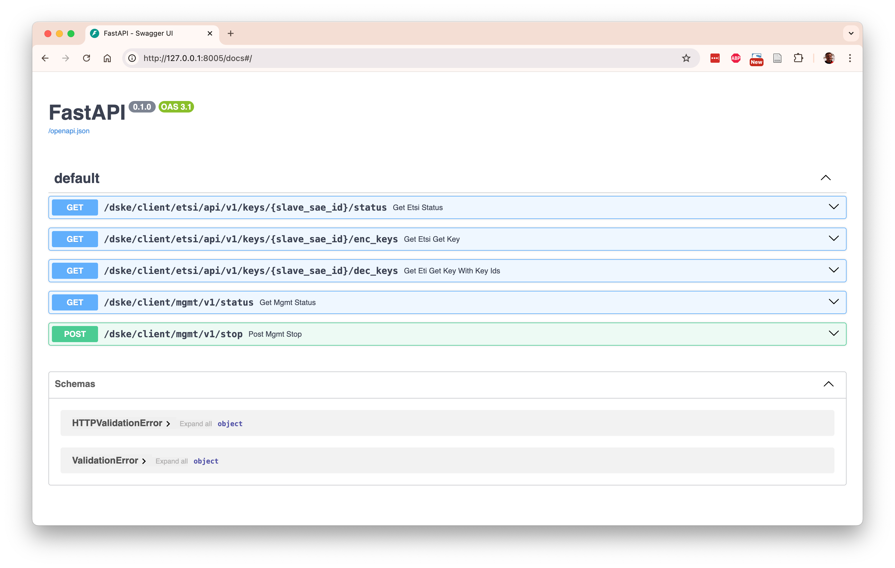
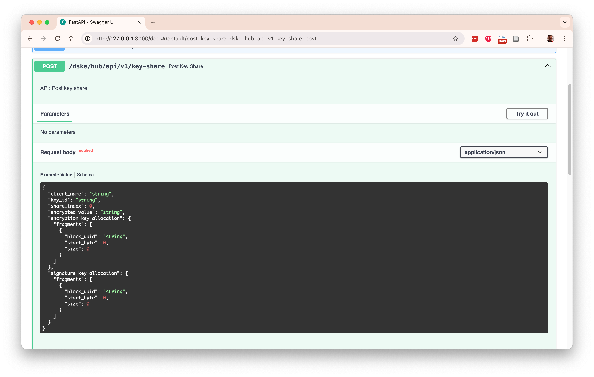

[Back to main page](/dske-python/)

# User guide

This page contains detailed end-user documentation.
It describes how to use the `manager.py` script to start and stop topologies and to generate
keys.

For an overview of what Distributed Symmetric Key Establishment (DSKE) is and what problem it solves
see the [introduction](what-is-dske-and-what-problem-does-it-solve.md).

If you just want hands-on instructions on how to get started running the code and generating keys
with a minimum of background information see the
[getting started guide](getting-started-guide.md).

For a detailed description of the DSKE protocol, see the
[protocol guide](protocol-guide.md).

If you are a software developer and would like more details about the implementation, see the
[developer guide](developer-guide.md).

## Topology file

We first need a topology YAML file which describes the topology of the network.
It lists the names of the DSKE clients (clients for short) and the
DSKE security hubs (hubs for short).

The repository contains an example `topology.yaml` file:

<pre>
$ <b>cat topology.yaml</b>
hubs:
  - name: hank
  - name: helen
  - name: hilary
  - name: holly
  - name: hugo
clients:
  - name: carol
  - name: celia
  - name: cindy
  - name: connie
  - name: curtis
</pre>

## The topology manager

The script `manager.py` is used to:
* Start a topology.
* Stop a topology.
* Retrieve the status of one or more nodes.
* Retrieve keys from client nodes.

Use the `--help` option to see the command line parameters:

<pre>
$ <b>./manager.py --help</b>
usage: manager.py [-h] [--client CLIENT | --hub HUB] configfile {start,stop,status,etsi-qkd} ...

DSKE Manager

positional arguments:
  configfile            Configuration filename
  {start,stop,status,etsi-qkd}
    start               Start all hubs and clients
    stop                Stop all hubs and clients
    status              Report status for all hubs and clients
    etsi-qkd            ETSI QKD operations

options:
  -h, --help            show this help message and exit
  --client CLIENT       Filter on client name
  --hub HUB             Filter on hub name
</pre>

You can also use the `--help` option to see the command line parameters for a specific sub-command:

<pre>
$ <b>./manager.py topology.yaml etsi-qkd --help</b>
usage: manager.py configfile etsi-qkd [-h] master_sae_id slave_sae_id {get-status,get-key,get-key-with-key-ids,get-key-pair} ...

positional arguments:
  master_sae_id         Master SAE ID
  slave_sae_id          Slave SAE ID
  {status,get-key,get-key-with-key-ids,get-key-pair}
    get-status          Invoke ETSI QKD Get status API
    get-key             Invoke ETSI QKD Get Key API
    get-key-with-key-ids
                        Invoke ETSI QKD Get Key with Key IDs API
    get-key-pair        Invoke ETSI QKD Get Key and Get Key with Key IDs APIs

options:
  -h, --help            show this help message and exit
</pre>

## Start the topology

To start all nodes in the DSKE topology, use the manager `start` command:

<pre>
$ <b>./manager.py topology.yaml start</b>
Waiting for all nodes to be stopped
Starting hub hank on port 8100
Starting hub helen on port 8101
Starting hub hilary on port 8102
Starting hub holly on port 8103
Starting hub hugo on port 8104
Starting client carol on port 8105
Starting client celia on port 8106
Starting client cindy on port 8107
Starting client connie on port 8108
Starting client curtis on port 8109
Waiting for all nodes to be started
</pre>

`topology.yaml` is the topology file that specifies the names of the hubs and clients that
are part of the topology.

The output reports that 10 nodes are started in total: 5 hub nodes (hank, helen, hilary, holly,
and hugo) and 5 client nodes (carol, celia, cindy, connie, and curtis).

The reported port numbers (8100, 8101, etc.) are the TCP port numbers for the REST interface of
each node.

## Stop the topology

To stop all nodes in the topology, use the manager `stop` command:

<pre>
$ <b>./manager.py topology.yaml stop</b>
Stopping client curtis on port 8109
Stopping client connie on port 8108
Stopping client cindy on port 8107
Stopping client celia on port 8106
Stopping client carol on port 8105
Stopping hub hugo on port 8104
Stopping hub holly on port 8103
Stopping hub hilary on port 8102
Stopping hub helen on port 8101
Stopping hub hank on port 8100
Waiting for all nodes to be stopped
</pre>

## One background process per node

Starting a topology spawns one Python background process for each node. 
You can see these processes using `ps` command:

<pre>
 $ <b>ps | grep Python</b>
 5818 ttys000    0:01.27 Python -m hub hank --port 8100
 5819 ttys000    0:01.26 Python -m hub helen --port 8101
 5820 ttys000    0:01.27 Python -m hub hilary --port 8102
 5821 ttys000    0:01.26 Python -m hub holly --port 8103
 5822 ttys000    0:01.25 Python -m hub hugo --port 8104
 5823 ttys000    0:01.55 Python -m client carol --port 8105 --hubs http://127.0.0.1:8100/hub/hank http://127.0.0.1:8101/hub/helen http://127.0.0.1:8102/hub/hilary http://127.0.0.1:8103/hub/holly http://127.0.0.1:8104/hub/hugo
 5824 ttys000    0:01.55 Python -m client celia --port 8106 --hubs http://127.0.0.1:8100/hub/hank http://127.0.0.1:8101/hub/helen http://127.0.0.1:8102/hub/hilary http://127.0.0.1:8103/hub/holly http://127.0.0.1:8104/hub/hugo
 5825 ttys000    0:01.55 Python -m client cindy --port 8107 --hubs http://127.0.0.1:8100/hub/hank http://127.0.0.1:8101/hub/helen http://127.0.0.1:8102/hub/hilary http://127.0.0.1:8103/hub/holly http://127.0.0.1:8104/hub/hugo
 5826 ttys000    0:01.53 Python -m client connie --port 8108 --hubs http://127.0.0.1:8100/hub/hank http://127.0.0.1:8101/hub/helen http://127.0.0.1:8102/hub/hilary http://127.0.0.1:8103/hub/holly http://127.0.0.1:8104/hub/hugo
 5827 ttys000    0:01.52 Python -m client curtis --port 8109 --hubs http://127.0.0.1:8100/hub/hank http://127.0.0.1:8101/hub/helen http://127.0.0.1:8102/hub/hilary http://127.0.0.1:8103/hub/holly http://127.0.0.1:8104/hub/hugo
...
</pre>

## Waiting for nodes to be started

It takes some time for each background process to startup and to get to the point that the
process is ready to accept and process incoming requests over its REST interfaces.
If we try to invoke any REST API before the node is fully started, we will get an error.
This is why the `start` command explicitly waits for all nodes to be started (it
reports `Waiting for all nodes to be started` at the end):

<pre>
$ <b>./manager.py topology.yaml start</b>
Waiting for all nodes to be stopped
Starting hub hank on port 8100
...
Starting client curtis on port 8109
<b>Waiting for all nodes to be started</b>
</pre>

## Waiting for nodes to be stopped

Similarly, it takes some time for each background process to completely stop and get to the
point that the TCP port number can be used again for restarting a node on the same TCP port again.
Even if the background process is completely stopped, the TCP port number can get stuck in
state TIME_WAIT and it can take the operating system up to 60 seconds to release the TCP port.
This is why the `start` command explicitly waits for all needed TCP ports to be available
(it reports `Waiting for all nodes to be stopped` at the beginning).

<pre>
$ <b>./manager.py topology.yaml start</b>
<b>Waiting for all nodes to be stopped</b>
Starting hub hank on port 8100
...
Starting client curtis on port 8109
Waiting for all nodes to be started
</pre>

If it takes longer than expected for a node to stop and for the TCP port to become available again
(i.e. to exist from state TIME_WAIT) the stop command will periodically report that it is still
waiting (this should not take longer than 60 seconds):

<pre>
$ <b>./manager.py topology.yaml stop</b>
Stopping client curtis on port 8109
...
Stopping hub hank on port 8100
Waiting for all nodes to be stopped
<b>Still waiting for client connie to be stopped
Still waiting for client connie to be stopped
Still waiting for client connie to be stopped</b>
</pre>

## The `--client` and `--hub` command line options

The manager command line option `--client CLIENT` can be used to apply a command to a single
client node.
For example, to start one individual client carol:

<pre>
$ <b>./manager.py topology.yaml --client carol start</b>
Waiting for client carol to be stopped
Starting client carol on port 8105
Waiting for client carol to be started
</pre>

Similarly, the manager command line option `--hub HUB` can be used to apply a command to a single
hub node.
For example, to stop one individual hub hugo:

<pre>
$ <b>./manager.py topology.yaml --hub hugo stop</b>
Stopping hub hugo on port 8104
Waiting for hub hugo to be stopped
</pre>

You can use the `--client` and `--hub` command line options multiple times.
For example:

<pre>$ <b>./manager.py topology.yaml --client carol --client corrie --hub hank start</b>
Waiting for client carol, client corrie, hub hank to be stopped
Starting hub hank on port 8100
Starting client carol on port 8105
Waiting for client carol, client corrie, hub hank to be started
</pre>

## Starting and stopping nodes directly

Behind the scenes, the `manager.py` script spawns a separate Python process each client node
and for each hub node.
If you so desire, you can also start these Python processes manually.

The Python module `client` implements the client node process.
Use the `--help` option to see its usage:

<pre>
$ <b>python -m client --help</b>
usage: __main__.py [-h] [--port PORT] [--hubs HUBS [HUBS ...]] name

DSKE Client

positional arguments:
  name                  Client name

options:
  -h, --help            show this help message and exit
  --port PORT           Port number
  --hubs HUBS [HUBS ...]
                        Base URLs for hubs (e.g., http://127.0.0.1:8100)
</pre>

The typical usage is to provide the client name, the port number, and a list of base URLs for
the hubs in the network. For example:

<pre>
$ <b>python -m client carol --port 8105 --hubs http://127.0.0.1:8100/hub/hank http://127.0.0.1:8101/hub/helen http://127.0.0.1:8102/hub/hilary http://127.0.0.1:8103/hub/holly http://127.0.0.1:8104/hub/hugo</b>
</pre>

Similarly, the Python module `hub` implements the client node process.
Use the `--help` option to see its usage:

<pre>
$ <b>python -m hub --help</b>

usage: __main__.py [-h] [-p PORT] name

DSKE Hub

positional arguments:
  name             Hub name

options:
  -h, --help       show this help message and exit
  -p, --port PORT  Port number
</pre>

The typical usage is to provide the hub name and the port number.

<pre>
$ <b>python -m hub helen --port 8101</b>
</pre>

As you can see, manually starting clients and hubs involves typing long error-prone commands
and requires some book-keeping about which node uses which TCP port number.
This is why the `manager.py` script exists;
it collects all the necessary information from the topology file and starts all the nodes with
the correct (long) command-line arguments.

## ETSI QKD 014 Get key

Use the manager `get-key` sub-command under the `etsi-qkd` command to invoke the ETSI QKD 014
"Get Key" API to retrieve a key for a pair of SAEs on the master SAE.

The `get-key` sub-command has the following command-line options:

<pre>
$ <b>./manager.py topology.yaml etsi-qkd carol curtis get-key --help</b>
usage: manager.py configfile etsi-qkd master_sae_id slave_sae_id get-key [-h] [--size SIZE]

options:
  -h, --help   show this help message and exit
  --size SIZE  Key size in bits
</pre>

In the following example we ask master SAE Carol for a key which is shared with slave SAE Celia:

<pre>
 $ <b>./manager.py topology.yaml etsi-qkd carol celia get-key</b>
Invoke ETSI QKD Get Key API for client carol on port 8105
{
  "keys": {
    "key_ID": "f47f23d7-be01-41d3-a5bc-106b2335e652",
    "key": "/j0FX08Tf9THPD0k1viX3g=="
  }
}
</pre>

The master / slave terminology comes from ETSI QKD 014 version 1 and will be revised in version 2.

## ETSI QKD 014 Get key with key IDs

Use the manager `get-key-with-key-ids` sub-command under the `etsi-qkd` command to invoke the 
ETSI QKD 014 "Get Key" API to retrieve a key for a pair of SAEs on the slave SAE.

The `get-key` sub-command has the following command-line options:

<pre>
$ <b>./manager.py topology.yaml etsi-qkd carol curtis get-key-with-key-ids --help</b>
usage: manager.py configfile etsi-qkd master_sae_id slave_sae_id get-key-with-key-ids [-h] key_id

positional arguments:
  key_id      Key ID

options:
  -h, --help  show this help message and exit
</pre>

In the following example we ask slave SAE Curtis for the key with key ID 
f47f23d7-be01-41d3-a5bc-106b2335e652 which was established with master SAE Carol:

<pre>
$ <b>./manager.py topology.yaml etsi-qkd carol celia get-key-with-key-ids f47f23d7-be01-41d3-a5bc-106b2335e652</b>
Invoke ETSI QKD Get Key with Key IDs API for client celia on port 8105
{
  "keys": [
    {
      "key_ID": "f47f23d7-be01-41d3-a5bc-106b2335e652",
      "key": "/j0FX08Tf9THPD0k1viX3g=="
    }
  ]
}
</pre>

## ETSI QKD 014 Get key pair

As a matter of convenience, there is also a `get-key-pair` sub-command to combine both the
"Get key" and the "Get key with key IDs" calls.

The `get-key-pair` sub-command has the following command-line options:

<pre>
$ <b>./manager.py topology.yaml etsi-qkd carol curtis get-key-pair --help</b>
usage: manager.py configfile etsi-qkd master_sae_id slave_sae_id get-key-pair [-h] [--size SIZE]

options:
  -h, --help   show this help message and exit
  --size SIZE  Key size in bits
</pre>

In the following example, we ask for a key pair between master SAE Carol and slave SAE Celia:

<pre>
$ <b>./manager.py topology.yaml etsi-qkd carol celia get-key-pair</b>
Invoke ETSI QKD Get Key API for client carol on port 8105
{
  "keys": {
    "key_ID": "cc658ffe-8d54-414b-b91f-20b59b03f034",
    "key": "jSOFUh56slAChUrzUExdbQ=="
  }
}
Invoke ETSI QKD Get Key with Key IDs API for client celia on port 8106
{
  "keys": [
    {
      "key_ID": "cc658ffe-8d54-414b-b91f-20b59b03f034",
      "key": "jSOFUh56slAChUrzUExdbQ=="
    }
  ]
}
Key values match
</pre>

And, finally, there is a `status` subcommand to invoke the "Status" ETSI QKD 014 API:

<pre>
$ <b<>./manager.py topology.yaml etsi-qkd carol celia get-status</b>
Invoke ETSI QKD Status API for client carol on port 8105
master_sae_id='carol' slave_sae_id='celia'
{
  "source_kme_id": "carol",
  "target_kme_id": "celia",
  "master_sae_id": "carol",
  "slave_sae_id": "celia",
  "key_size": 128,
  "stored_key_count": 25000,
  "max_key_count": 1000,
  "max_key_per_request": 1,
  "max_key_size": 100000,
  "min_key_size": 1,
  "max_sae_id_count": 0
}
</pre>

## Report the topology status

Use the manager `status` command to report the status of each node in the topology:

<pre>
$ <b>./manager.py topology.yaml status</b>
Status for hub hank on port 8100
{
  "name": "hank",
  "peer_clients": [
    {
      "client_name": "carol",
      "local_pool": {
        "blocks": [
          {
            "uuid": "4cb97ab1-0e3f-4f48-a0d7-90de58e85d53",
            "size": 2000,
            "data": "AAAAAAAAAAAAAA==...",
            "nr_used_bytes": 32,
            "nr_unused_bytes": 1968
          }
        ],
        "owner": "local"
      },
      "peer_pool": {
        "blocks": [
          {
            "uuid": "c142de3a-8464-440f-bbfd-78937481732a",
            "size": 2000,
            "data": "AAAAAAAAAAAAAA==...",
            "nr_used_bytes": 48,
            "nr_unused_bytes": 1952
          }
        ],
        "owner": "peer"
      }
    },
    ... snip ...
  ]
}
</pre>

You can also use the `--client` or `--hub` command-line option to only report the status of a single
client or hub node, for example:

<pre>
$ <b>./manager.py topology.yaml --client celia status</b>
Status for client celia on port 8106
{
  "name": "celia",
  "peer_hubs": [
    {
      "hub_name": "hank",
      "registered": true,
      "local_pool": {
        "blocks": [
          {
            "uuid": "03478f57-a705-4c9c-940e-58ff5d9b52ea",
            "size": 2000,
            "data": "AAAAAAAAAAAAAA==...",
            "nr_used_bytes": 32,
            "nr_unused_bytes": 1968
          }
        ],
        "owner": "local"
      },
      "peer_pool": {
        "blocks": [
          {
            "uuid": "b7f83d46-c982-41d9-ba35-4965471bb56a",
            "size": 2000,
            "data": "AAAAAAAAAAAAAA==...",
            "nr_used_bytes": 48,
            "nr_unused_bytes": 1952
          }
        ],
        "owner": "peer"
      }
    },
    ... snip ...
  ]
}
</pre>

A useful trick is to use the `tail -n +2` command to skip the first line of output, and to pipe
the remaining output (which is JSON) through the `jq` command to colorize the JSON output:

<pre>
$ <b>./manager.py topology.yaml --client carol status | tail -n +2 | jq</b>
{
  "name": "carol",
  "peer_hubs": [
    {
      "hub_name": "hank",
      "registered": true,
      "local_pool": {
        "blocks": [
          {
            "uuid": "c142de3a-8464-440f-bbfd-78937481732a",
            "size": 2000,
            "data": "AAAAAAAAAAAAAA==...",
            "nr_used_bytes": 48,
            "nr_unused_bytes": 1952
          }
        ],
        "owner": "local"
      },
      ... snip ...
    }
  ]
}
</pre>

Even better, you can use the `pq` command with a query to look for specific fields in the JSON
output.
In the following example we display the information about the local pool for peer-hub hank
on client carol:

<pre>
$ <b>./manager.py topology.yaml --client carol status | tail -n +2 | jq '(.peer_hubs[] | select(.hub_name == "hank") .local_pool)'</b>
{
  "blocks": [
    {
      "uuid": "c142de3a-8464-440f-bbfd-78937481732a",
      "size": 2000,
      "data": "AAAAAAAAAAAAAA==...",
      "nr_used_bytes": 48,
      "nr_unused_bytes": 1952
    }
  ],
  "owner": "local"
}
</pre>

## Log files

Each node produces an `.out` log file for debugging purposes.
The information in this log file will vary wildly as the implementation progresses.
For example, the log file for client carol is `client-carol.out`:

<pre>
$ <b>cat client-carol.out</b>
INFO:     Started server process [2353]
INFO:     Waiting for application startup.
INFO:     Begin register task for peer hub None
INFO:     Begin register task for peer hub None
INFO:     Begin register task for peer hub None
INFO:     Begin register task for peer hub None
INFO:     Begin register task for peer hub None
INFO:     Application startup complete.
INFO:     Uvicorn running on http://127.0.0.1:8105 (Press CTRL+C to quit)
INFO:     Call PUT http://127.0.0.1:8100/hub/hank/dske/oob/v1/registration 200
INFO:     Call PUT http://127.0.0.1:8101/hub/helen/dske/oob/v1/registration 200
INFO:     Call PUT http://127.0.0.1:8103/hub/holly/dske/oob/v1/registration 200
INFO:     Finish register task for peer hub None
INFO:     Finish register task for peer hub None
INFO:     Finish register task for peer hub None
INFO:     Call PUT http://127.0.0.1:8102/hub/hilary/dske/oob/v1/registration 200
INFO:     Call PUT http://127.0.0.1:8104/hub/hugo/dske/oob/v1/registration 200
INFO:     Begin request PSRD task for peer hub hank and pool owner local
INFO:     Begin request PSRD task for peer hub hank and pool owner peer
INFO:     Begin request PSRD task for peer hub helen and pool owner local
INFO:     Begin request PSRD task for peer hub helen and pool owner peer
INFO:     Begin request PSRD task for peer hub holly and pool owner local
INFO:     Begin request PSRD task for peer hub holly and pool owner peer
INFO:     Finish register task for peer hub None
INFO:     Finish register task for peer hub None
INFO:     Begin request PSRD task for peer hub hilary and pool owner local
INFO:     Begin request PSRD task for peer hub hilary and pool owner peer
... snip ...
</pre>

## REST interfaces

The nodes communicate with each other over REST interfaces, implemented using FastAPI.
There are four types of REST interfaces:

1. `api` REST interfaces model the actual DSKE protocol specified in the draft. 
   Note that the draft currently only describes the protocol at the semantic level, and not (yet)
   the message encoding. 
   We do not intend to imply that REST is the best encoding for the message encoding; a leaner 
   binary encoding may be more appropriate for this type of protocol.
   We only chose REST to make prototyping and studying the protocol easier the semantic level.

2. `oob` REST interfaces model the out-of-band actions mentioned in the draft, for example 
   delivering a block of pre-shared random data (PSRD).
   In real life, this would not be done over a REST interface but using some other mechanism
   (e.g. physically shipping a tamper-proof device with gigabytes of random data). 
   In this code we use REST interface to model these actions so that we can automate the scripting
   of entire end-to-end testing scenarios.

3. `esti` REST interfaces are implement the ETSI QKD 014 interface (a subset at this time) on the
   DSKE clients to deliver the produced keys to the Secure Application Entity (SAE) consumers.

4. `mgmt` management REST interfaces to control and debug the various nodes (e.g. to stop them and
   to retrieve operational status to "look inside" of them to see what is happening).

## REST interface documentation

The REST interface for each node is available at the reported port number when the topology was
started.

In the above example, the REST interface for hub "Hank" is available at `http://127.0.0.1:8100`

In addition to the REST interface itself, documentation is also available at
`http://127.0.0.1:8100/docs` and `http://127.0.0.1:8100/redoc`.
You can also manually invoke the REST APIs from the documentation page (click on an API endpoint
and then click on "Try it out").

Here is an example of the automatically generated documentation at `http://127.0.0.1:8105/docs`
for a client node:

Here is an example of the automatically generated documentation at `http://127.0.0.1:8100/docs`
for a hub node:

When you click on the row for `POST /dske/hub/api/v1/key-share` you see the detailed documentation
for that particular REST endpoint:

### Invoking the REST interface

Here is an example of invoking the API to get the status of 

In this example, we pipe the output of `curl` through `jq` (JSON query) to pretty-print the
JSON REST response:

<pre>
$ <b>curl --silent http://127.0.0.1:8100/hub/hank/mgmt/v1/status | jq</b>
{
  "name": "hank",
  "peer_clients": [
    {
      "client_name": "carol",
      "local_pool": {
        "blocks": [
          {
            "uuid": "4cb97ab1-0e3f-4f48-a0d7-90de58e85d53",
            "size": 2000,
            "data": "AAAAAAAAAAAAAA==...",
            "nr_used_bytes": 32,
            "nr_unused_bytes": 1968
          }
        ],
        "owner": "local"
      },
      ... snip ...
    }
  ],
  "shares": [
    {
      "key_id": "bc266858-9c0e-4d9b-8d48-b7f312b1aeb5",
      "share_index": 0,
      "value": "+xLr39AZfdNefw==..."
    }
  ]
}
</pre>

Note 1: The `status` REST API is intended for debugging and understanding the protocol; it exposes
information that should not be exposed in a production environment.

Note 2: There is currently no authentication on any of the REST interfaces.
It is my understanding (but I could be wrong) that the DSKE protocol does not require the API
interfaces to be authenticated nor encrypted to be secure.

