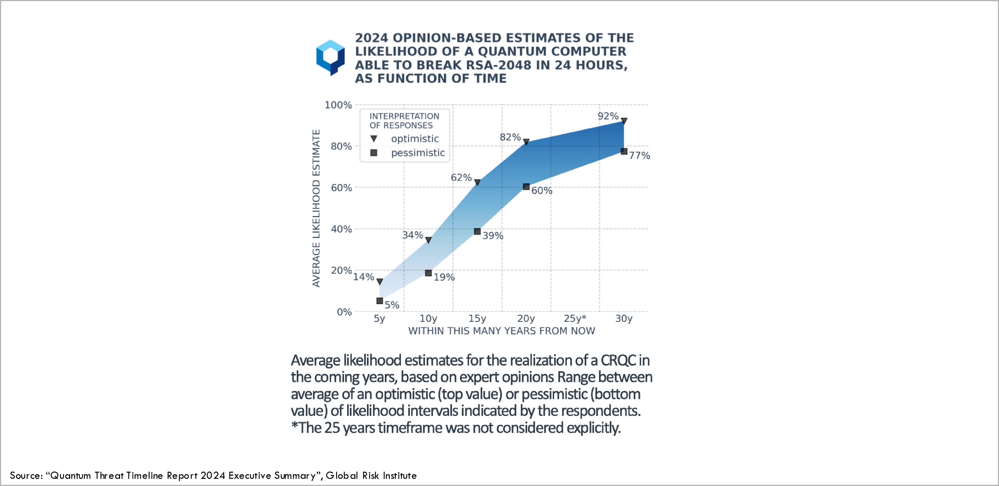

[Back to main page](/dske-python/)

# What is Distributed Symmetric Key Establishment (DSKE) and what problem does it solve?

## Key establishment protocols

As the name suggests, DSKE is one example of a key establishment protocol.
Key establishment protocols are also known as
[key agreement protocols](https://en.wikipedia.org/wiki/Key-agreement_protocol)
or key distribution protocols.

When two devices want to communicate with each other over a network in a secure manner,
they use encryption:
the sender encrypts the traffic using an encryption key
and the receiver decrypts the traffic using a decryption key.

Encrypting the traffic provides confidentiality: it keeps the information secret even if there
is some party (an eavesdropper) who is able to observe the encrypted data as it flows over
the network.

Confidentiality is not the only aspect of secure communications.
One also needs integrity (making sure the data was not modified in transit),
authentication (verify that each communicating party is who they claim to be),
and non-repudiation (prevent a sender from denying having sent a message,
or a receiver from denying having received it).
But here we focus on confidentiality.

For the transfer of large volumes of data, the encryption en decryption is typically done
using a symmetric encryption protocol.
In symmetric encryption protocols the same key is used as both the encryption key and the
decryption key.

Before a sender and a receiver can communicate with each other using a symmetric encryption
protocol they must first agree on which encryption key to use.

One possible approach is to simply manually configure the encryption key on both the sender
device and the receiver device.
This approach is called using a 
[Pre-Shared Key (PSK)](https://en.wikipedia.org/wiki/Pre-shared_key)
and has several disadvantages:

 * It is a cumbersome and error-prone manual procedure.

 * It is difficult to periodically roll-over the keys, making it less secure.

 * Two devices cannot communicate unless they have configured pre-shared keys a-priori.

For these reasons, more dynamic key establishment protocols (key agreement protocols,
key distribution protocols) are often used instead of using pre-shared keys.

Each type of secure communications protocol has its own dynamic key establishment mechanism.
For example,
[IPsec](https://en.wikipedia.org/wiki/IPsec)
includes the
[Internet Security Association and Key Management Protocol (ISAKMP)](https://en.wikipedia.org/wiki/Internet_Security_Association_and_Key_Management_Protocol)
as a sub-protocol.
As another example,
[Transport Layer Security (TLS)](https://en.wikipedia.org/wiki/Transport_Layer_Security)
includes specific messages and procedures for key establishment.

But underpinning all of these specific key establishment protocols, there is a common set of
mathematical algorithms that is used by all of them:
 * [Diffie-Hellman (DH)](https://en.wikipedia.org/wiki/Diffie%E2%80%93Hellman_key_exchange)
 * [Elliptic Curve Diffie-Hellman (ECDH)](https://en.wikipedia.org/wiki/Elliptic-curve_Diffie%E2%80%93Hellman)
 * [Rivest Shamir Adleman (RSA)](https://en.wikipedia.org/wiki/RSA_cryptosystem)

We won't go into the details of how these mathematical algorithms work.
What is important for the present discussion is that all of these algorithms are based on
the observation that there exist certain mathematical functions which are very easy to compute
for a computer, but for which the inverse function is very difficult to compute, even for
the biggest super computer.
For example, any computer can multiply two large prime numbers very quickly.
But if the prime numbers are large enough, it takes millions of years to factor the resulting
product back into the original prime factors.
To be specific, the security of RSA depends on the computational complexity of
[factorization](https://en.wikipedia.org/wiki/Factorization),
and the security of DH and ECDH depend on the computational complexity of
[logarithms in a discrete field](https://en.wikipedia.org/wiki/Discrete_logarithm)
.

## Shor's algorithm

In 1994 the assumption that factorization and discrete logarithms were very difficult to compute
was shattered by the discovery of a new algorithm called
[Shor's algorithm](https://en.wikipedia.org/wiki/Shor%27s_algorithm).
Shor's algorithm is able to factor large numbers and compute discrete logarithms very fast,
but it can only run on a new type of computer called a
[quantum computer](https://en.wikipedia.org/wiki/Quantum_computing).

This means that an attacker who has access to a sufficiently powerful quantum computer
to run Shor's algorithm will be able to break existing key establishment protocols such as DH,
ECDH, and RSA.
Such a sufficiently powerful quantum computer is referred to as a
Cryptanalytically Relevant Quantum Computer (CRQC).

Quantum computers do already exist;
they are commercially available from 
[many large companies and startups](https://thequantuminsider.com/2025/09/23/top-quantum-computing-companies/).
But none of the quantum computers that exist today are sufficiently reliable and powerful to run
Shor's algorithm;
in other words: there are no CRQCs yet.

Various experts have different estimates for when the first CRQC will appear, in other words
when existing key establishment protocols such as DH, ECDH, and RSA will be broken:

For this reason, various governments and standardization organizations have enacted rules
and guidelines requiring organizations to migrate away from the current quantum-unsafe key
agreement protocols to new quantum-safe key agreement protocols, which cannot be broken
by future quantum computers.

## Quantum-safe key establishment

There are several options for the new quantum-safe key agreement protocols to replace the old
quantum-unsafe key agreement protocols:

 * [Post Quantum Cryptography (PQC)](https://en.wikipedia.org/wiki/Post-quantum_cryptography)
   uses different mathematical problems to replace factorization and discrete logarithms.
   One example of such a PQC key establishment protocol is called
   Module Lattice based Key-Encapsulation Mechanism (ML-KEM) which was recently standardized
   in
   [NIST](https://en.wikipedia.org/wiki/National_Institute_of_Standards_and_Technology) standard
   [FIPS 203](https://nvlpubs.nist.gov/nistpubs/FIPS/NIST.FIPS.203.pdf).

 * [Quantum Key Distribution (QKD)](https://en.wikipedia.org/wiki/Quantum_key_distribution)
   implements key establishment using the quantum-mechanical properties of photons that are
   exchanged over optical fibers or through free space.

 * Distributed Symmetric Key Establishment (DSKE) implements quantum-safe key establishment
   in a completely different manner.
   The rest of this chapter describes the details of how our implementation of the DSKE protocol
   works.
   This GitHub repository contains an open source proof-of-concept implementation of the DSKE
   approach.